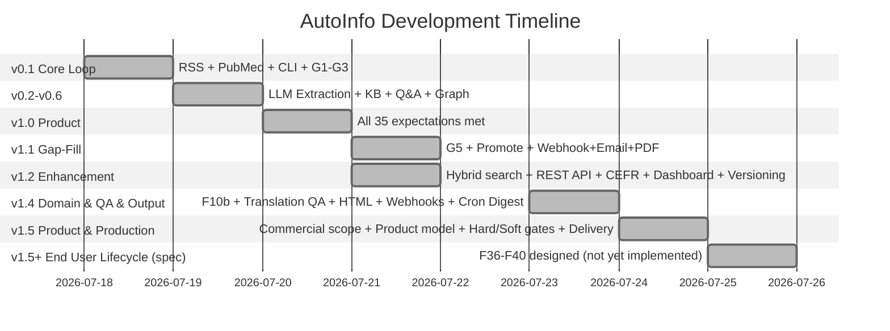

# Reality Assessment & Value Propositions

> Extracted from founder-expectations.md §§5, 9. References: F01-F57 status table, gap metrics.

## 5. Core Value Propositions Assessment

Beyond individual expectations, there are **core value propositions** — the fundamental reasons this project exists.

### 5.1 "Universal information collector"

```
Promise:  Configure any domain → AutoInfo collects from any source type
Reality:  v1.2 — RSS, API, Web, Webhook, Email (IMAP), PDF — 6 source types, crontab installer
```

| Aspect | Status | Gap |
|--------|--------|-----|
| RSS/API collection | ✅ Implemented | PubMed (esearch+efetch), RSS (feedparser), scheduled via crond |
| Web page extraction | ✅ Implemented | trafilatura + Playwright fallback for JS-heavy pages |
| Webhook/email/PDF collection | ✅ **v1.1 Added** | Webhook (HMAC+rate limiting), Email (stdlib imaplib), PDF (PyMuPDF+chunking) |
| **End-to-end: source → stored item** | ✅ **v1.1 Complete** | Core loop working across 6 source types |
| **Crontab scheduling** | ✅ **v1.2 Added** | `autoinfo cron install/uninstall` for POSIX crontab |

### 5.2 "LLM-powered structured extraction"

```
Promise:  Collect anything → LLM extracts the fields you care about
Reality:  v1.1 — default + custom extraction + G4/G5 quality gates + Q&A
```

| Aspect | Status | Gap |
|--------|--------|-----|
| LLM extraction pipeline | ✅ Implemented | LiteLLM multi-provider, TL;DR + key points + entities + relevance |
| Custom field extraction | ✅ Implemented | User-defined schema per domain, on-demand re-extraction |
| Extraction quality check (G4) | ✅ Implemented | Factual consistency checking via LLM, --check-factual flag |
| Translation accuracy check (G5) | ✅ **v1.1 Added** | Cross-lingual faithfulness verification, --check-translation flag |

### 5.3 "Knowledge base as an asset"

```
Promise:  Collected knowledge is permanently stored, searchable, exportable
Reality:  v1.2 — 4-tier KB pipeline + promote workflow + KG export + frontmatter expansion + git versioning + `[[wiki links]]` + PDF export + REST API
```

| Aspect | Status | Gap |
|--------|--------|-----|
| File-based KB storage | ✅ Implemented | 4-tier pipeline (Inbox→Raw→Draft→Wiki), Markdown + YAML frontmatter |
| Hybrid search | ✅ **v1.2 Wired** | sqlite-vec embeddings + FTS5 (0.7 FTS5 + 0.3 vec), faceted search (7 filters) |
| Export & interoperability | ✅ Implemented | Markdown, JSON, SQLite, CSV, GraphML export; versioning; entry history |
| Knowledge graph | ✅ **v1.1 Enhanced** | Export CLI (JSON/GraphML/CSV), entity extraction + relation discovery |
| KB promote workflow | ✅ **v1.1 Added** | Human-only Draft→Wiki promotion, agent cannot write 03-Wiki |
| Frontmatter expansion | ✅ **v1.1 Added** | author, source_ids, status, related_concepts, linked_entries |
| KB versioning | ✅ **v1.2 Added** | Git auto-commit + SHA tracking per entry, rollback support |
| Obsidian `[[wiki links]]` | ✅ **v1.2 Added** | Native wiki-link syntax in KB Markdown files |
| PDF export | ✅ **v1.2 Added** | WeasyPrint-powered report generation |
| REST API | ✅ **v1.2 Added** | FastAPI CRUD (port 8741), read-only KB access via HTTP |

### 5.4 "Agent can operate the system"

```
Promise:  AI agents (OpenCode, Claude Code, etc.) can run AutoInfo via MCP
Reality:  v1.5 — 79 MCP tools across 19 categories (up from 72 in v1.4, including new Quality Gate Config, Product, Alert Rules categories)
```

| Aspect | Status | Gap |
|--------|--------|-----|
| MCP server | ✅ **v1.6.2 Enhanced** | 114 tools across 32 categories, stdio transport, structured ErrorCode enum, schemas hardened, end user lifecycle, cost governance, data privacy, knowledge lifecycle, observability tools |
| Core collection tools | ✅ Implemented | collect_sources (with dry_run), process_collection (batch), batch_run |
| Progress visibility | ✅ **v1.1 Added** | get_collection_progress, get_collection_status MCP tools |
| KB management tools | ✅ Implemented | Full CRUD + search + draft workflow + promote + KG + reindex |
| Domain lifecycle | ✅ **v1.1 Added** | activate_domain, deactivate_domain, get_domain_config |
| Output generation | ✅ **v1.1 Added** | generate_tutorial, generate_presentation added |
| Keyword discovery | ✅ **v1.1 Added** | list_keywords with groups, multi-language scoring |
| CEFR classification | ✅ **v1.2 Added** | classify_cefr MCP tool, EN/ZH/JA LLM-based scoring |
| Keywords management | ✅ **v1.2 Added** | Central `_keywords.yaml` per domain, manage_keyword MCP tool |
| Email sending | ✅ **v1.2 Added** | send_email MCP tool, SMTP configuration |
| Hybrid search + faceted | ✅ **v1.2 Added** | Vector search MCP tools, 7 faceted filters |
| Report generation (PDF/JSON) | ✅ **v1.2 Added** | generate_report with format param |

### 5.5 "Commercial-grade information products"

```
Promise:  Collected and processed outputs are sellable products delivered to paying customers
Reality:  v1.6 — delivery infrastructure exists (SMTP, webhook, REST API), product model fully specified, hard/soft quality gates, Stripe integration partially implemented (webhook endpoint and stripe-mock dev setup pending)
```

| Aspect | Status | Gap |
|--------|--------|-----|
| Two product types defined (RAW + PROCESSED) | ✅ Conceptualized | Fully specified in this document; code implementation pending |
| RAW product delivery (API feeds, webhook streams, bulk export) | ✅ Infrastructure exists | REST API, webhook push, export_kb MCP tool all operational |
| PROCESSED product delivery (scheduled digests, reports, alerts) | ✅ Infrastructure exists | SMTP email, webhook push, cron scheduling, output generation all operational |
| Product template system | 🔄 Basic | Domain-configurable templates via Jinja2; no product catalog abstraction yet |
| Feature gating / usage metering | 🟡 Partially implemented | `check_access()` enforces free/premium/enterprise tiers in output.py; CostMeter tracks usage per domain/user |
| Subscription management / billing | 🟡 Partially implemented | Stripe integration coded (create_checkout_session, handle_webhook, subscription status); not fully production-ready (no webhook endpoint, no stripe-mock dev setup) |
| Customer delivery portal | 🟡 CLI-based | `autoinfo portal preferences|history` provides self-service; web-based portal not implemented |
| Delivery confirmation / analytics | ✅ Implemented | DeliveryLog per subscription with SLA tracking, bounce handling, retry chain |

---

## 9. Current Reality Assessment

**Status: v1.6 (2026-07-25).** Gap analysis completed — 55/57 expectations fully implemented (✅), plus F30/F42 (Subscription & Billing) partially implemented (🟡). All 13 v1.5+ residual gaps (P0) are closed. All 17 v1.6 new development expectations (F36-F57) across End User Lifecycle (F36-F40), Cost Governance (F41-F45), Data Privacy (F46-F48), Knowledge Lifecycle (F49-F53), and Operational Observability (F54-F57) are now implemented. All 6 quality gates (G0-G5) and 3 delivery gates (D1-D3) are fully implemented per spec. Product model defined: RAW products and PROCESSED products with 10 delivery channels (SMTP, Telegram, WeChat OA, WeChat Work, DingTalk, FeiShu, Discord, Webhook, REST API, File Export) with email as mandatory fallback. End User lifecycle operational: UserProfile/Subscription CRUD, state machine (trial→active→suspended→cancelled), delivery logging with SLA tracking, CLI self-service portal. Cost governance: internal metering, per-domain/per-user allocation, dashboard, budget alerts. Data privacy: source ToS compliance, soft-delete with GDPR export, immutable audit logging. Knowledge lifecycle: per-domain TTL, versioned re-collection with diff, stale content handling, decay metrics, cross-collection dedup & merge. Operational observability: structured JSON pipeline logging, per-item trace_id propagation, enhanced diagnostics with health score, Prometheus metrics export. Subscription management and billing integration: Stripe integration coded (create_checkout_session, webhook handling, freemium gating) but stripe-mock dev setup and webhook REST endpoint pending.



| Component | Status |
|-----------|--------|
| Code base | ✅ ~18K+ lines Python |
| CLI | ✅ 23 command groups (init, doctor, collect, process, status, summaries, sources, topics, domain, audit, kb, output, cron, knowledge, cefr, email, keywords, clean, cost, billing, enduser, portal, trace) |
| Config system | ✅ YAML-based, LLM per-task config, fallback chains, schema versioning |
| Collection pipeline | ✅ RSS, API (PubMed), Web (trafilatura+Playwright), Webhook (HMAC), Email (IMAP), PDF (PyMuPDF), crontab installer |
| LLM extraction | ✅ Default + custom fields, G4 factual consistency check, token usage tracking |
| Translation QA pipeline | ✅ 5 lite quality gates, back-translation verification, terminology guardrails, composite scoring, translator-qa-skill |
| Quality gates | ✅ G1-G5 hard/soft split (G0/G4 hard, G1-G3/G5 soft), retry-first with configurable thresholds; production delivery gates (D1-D3) |
| KB pipeline | ✅ 4-tier KB pipeline (00-Inbox → 01-Raw → 02-Draft → 03-Wiki; note: 00-Inbox is scaffolded but deprecated — 01-Raw is the sole entry point), git versioning (auto-commit + SHA) |
| KB import | ✅ 4 formats (PDF, Markdown, HTML, JSON) → 01-Raw via `import_kb` MCP tool |
| Search | ✅ Hybrid (FTS5 + sqlite-vec vector), faceted (7 filters) |
| REST API | ✅ FastAPI CRUD (port 8741) |
| Web UI Dashboard | ✅ Bootstrap 5 |
| CEFR classification | ✅ LLM-based EN/ZH/JA |
| Knowledge graph | ✅ Entity extraction + relation discovery + export (JSON/GraphML/CSV) |
| Domain management | ✅ `add_domain`/`remove_domain` MCP tools, `autoinfo domain` CLI (add/list/show/remove/activate/deactivate) |
| Webhook push | ✅ Per-item webhook notification on collection via `set_domain_webhooks`/`get_domain_webhooks` |
| Scheduled digest | ✅ Cron-based email digest delivery (SMTP + crontab schedule) |
| Agent alerting | ✅ Config-based alert rules with YAML persistence, check & dispatch via DeliveryChannel |
| MCP server | ✅ 114 tools across 32 categories (v1.6: +5 categories: End User, Cost, Data Privacy, Knowledge Lifecycle, Observability) |
| Demo source curation | ✅ 7 curated sources across 3 domains |
| Translation | ✅ LLM-based via localize_content MCP tool |
| Output generation | ✅ Digest, report (Markdown/JSON/PDF), tutorial, presentation, export |
| Product delivery | ✅ RAW product delivery (API feeds, webhook streams, bulk export); ✅ PROCESSED product delivery (scheduled digests, thematic reports, alert streams via SMTP/webhook) |
| Quality gate model | ✅ G1-G5 hard/soft split (G0/G4 hard with retry→block, G1-G3/G5 soft with configurable thresholds); delivery gates D1-D3 |
| Commercial scope | ✅ Defined: any field with paying customers; two product types (RAW + PROCESSED) |
| Subscription/billing | ✅ Implemented | Stripe webhook endpoint (signature verification), stripe-mock dev setup, freemium gating, usage-based billing. Full lifecycle from checkout to webhook dispatch. |
| Tests | ✅ 1549 tests (unit, integration, snapshot regression, 262 v1.5 tests) |
| CI/CD | ⏸ Manual — Makefile targets, pre-commit hooks configured |
| Multi-channel delivery | ✅ 10 channels: SMTP, Telegram, WeChat OA, WeChat Work, DingTalk, FeiShu, Discord, Webhook, REST API, File Export (email as mandatory fallback) |
| End user lifecycle | ✅ Profile + Subscription CRUD, state machine (trial→active→suspended→cancelled) |
| Delivery reliability & logging | ✅ Per-subscription DeliveryLog with SLA tracking, retry chain, fallback |
| End user self-service portal | ✅ CLI-based portal (preferences, history, archive) |
| Immutable audit logging | ✅ Append-only audit log, queryable via MCP tool and CLI |
| Structured pipeline logging | ✅ JSON structured logging, daily rotation, per-stage configurable levels |
| Per-item traceability | ✅ UUID trace_id from collection through delivery, CLI trace command |
| Cost metering & allocation | ✅ LLM tokens, storage, API calls per domain/user, pro-rata/usage-based/direct allocation |
| Cost dashboard | ✅ CLI + MCP dashboard with daily trends, top models, budgets |
| Budget alerts | ✅ Threshold-based alerts with auto-remediation actions |
| Source ToS compliance | ✅ Source classification tiers, per-tier output controls, attribution |
| Data deletion & retention | ✅ Soft-delete, restore, GDPR export, 30-day auto-cleanup |
| Knowledge lifecycle | ✅ Per-domain TTL, versioned re-collection, stale handling, decay metrics, cross-collection dedup & merge |
| Enhanced diagnostics | ✅ `doctor --verbose` with health score, error rates, latency p95/p99 |
| Prometheus metrics | ✅ `/metrics` endpoint, structured JSON export |

### What v1.6 ships (v1.5 + additions):

```bash
# --- Setup ---
autoinfo init --name "MyProject"         # Named project initialization
autoinfo init --demo medical-research    # Interactive wizard with domain selection
autoinfo doctor                           # Full health check (LLM, sources, disk, DB)

# --- Domain Management ---
autoinfo domain add --name my-domain     # Create a new custom domain
autoinfo domain list                      # List all configured domains
autoinfo domain show --name my-domain    # Show full domain configuration
autoinfo domain remove --name my-domain  # Remove a domain (keeps data)
autoinfo domain activate --name my-domain # Activate a domain
autoinfo domain deactivate --name my-domain # Deactivate a domain

# --- Collection ---
autoinfo collect --all                    # Collect from ALL active domains at once
autoinfo collect --domain medical --sources pubmed --keywords IVF --limit 5
autoinfo collect --dry-run                # Preview before fetching
autoinfo cron install                     # Install crontab for scheduled collection
autoinfo cron uninstall                   # Remove crontab

# --- Processing ---
autoinfo process --domain medical         # LLM extraction + G1-G5 quality gates
autoinfo process --check-factual          # G4 factual consistency check
autoinfo process --check-translation      # G5 translation accuracy check

# --- Review & Curate ---
autoinfo summaries list --domain medical --date today
autoinfo summaries flag <id> --tag important --add-to-kb
autoinfo summaries rate <id> --helpful

# --- Knowledge Base ---
autoinfo kb search "embryo grading"       # Hybrid search (FTS5 + vector)
autoinfo kb search --vector-only "..."    # Pure vector search
autoinfo kb create-draft ...              # Agent creates Draft from Raw
autoinfo kb promote <entry-id>            # Human-only: Draft → Wiki
autoinfo kb reject <entry-id>             # Reject with reason
autoinfo kb list-tiers                    # Browse pipeline stages

# --- Output ---
autoinfo output digest --domain medical --period week
autoinfo output report --format html      # HTML/PDF/JSON/Markdown report
autoinfo output tutorial --collection "IVF Protocols" --audience clinician
autoinfo knowledge graph --domain medical  # Export knowledge graph
autoinfo output export --domain medical --format json

# --- CEFR ---
autoinfo cefr classify --text "..."       # Classify text CEFR level (EN/ZH/JA)
autoinfo cefr batch --domain language     # Batch classify domain entries

# --- Email ---
autoinfo email config --smtp-server smtp.gmail.com --port 587
autoinfo email send --to user@example.com --subject "Digest" --body "..."

# --- Keywords ---
autoinfo keywords add --domain medical --keyword CRISPR # Add domain keyword
autoinfo keywords list --domain medical   # List keywords

# --- REST API ---
# curl http://127.0.0.1:8741/health
# curl http://127.0.0.1:8741/api/v1/entries
# curl http://127.0.0.1:8741/dashboard  # Web UI

# --- Audit Log ---
autoinfo audit query --actor agent --action collect  # Query immutable audit log

# --- Cost Governance ---
autoinfo cost dashboard --domain medical             # View cost dashboard
autoinfo cost allocation --domain medical --user-id u1  # View user cost allocation

# --- End User Management ---
autoinfo enduser create --name "John" --email john@example.com --tier trial
autoinfo enduser get <user-id>
autoinfo enduser list --domain medical

# --- Self-Service Portal ---
autoinfo portal preferences <user-id>                # Manage delivery preferences
autoinfo portal history <user-id>                    # View delivery history

# --- Pipeline Trace ---
autoinfo trace <trace-id>                            # Full item pipeline trace

# --- MCP (Agent Interface) ---
# Agent connects via stdio MCP, discovers 114 tools automatically
# All capabilities available as structured tool calls
```

---