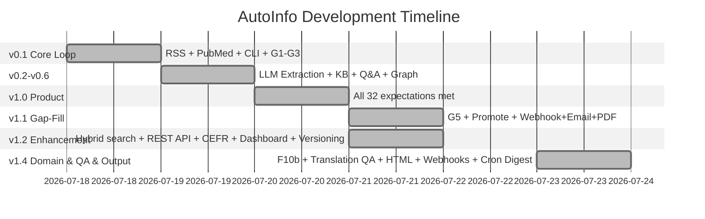

# Founder's Expectations

> Acceptance from the founder's perspective: does the project actually deliver on the original vision?
> Dimension 3 of the multi-dimension verification system.

---

## 1. Why Founder's Expectations?

AutoInfo is a new project — no tests, no quality gates, no users yet. The codebase is empty. But there's a harder question:

**Does this project actually solve the problem I created it to solve?**

This document answers that question. It defines what "done" looks like from the founder's perspective, before a single line of code is written. It's the blueprint for what AutoInfo must become.

### 1.1 The Project's Promise

> **AutoInfo 是一个通用信息追踪与知识库平台。你配置信源和关注领域，它自动完成采集、结构化提取、摘要、建立可查询的知识库。**
>
> AutoInfo 是你的"信息助理"——它不是帮你搜索，而是把从采集到知识沉淀的流程自动化、质量可控。你选择信源和方向，它完成剩下的所有体力活。领域不限，通用平台。

**Core insight**: AutoInfo's current demo domains (medical research, AI commercial intelligence, language learning) are **illustrative, not exhaustive**. The platform is **domain-agnostic** — any field where high-quality information exists and users want to track it. The three demo domains exist to validate the concept and showcase what's possible. Users define their own fields.

| Demo Domain | Purpose | Key User During Validation |
|-------------|---------|---------------------------|
| **Medical Research** (辅助生殖/脑科学/神经科学) | Validates academic paper collection, structured metadata extraction, citation-aware KB | Founder (P0 validation) |
| **AI Commercial Intelligence** | Validates multi-source collection (API + web + feeds), structured ranking/case data, trend detection | Founder (P0 validation) |
| **Language Learning** (children's English reading) | Validates level classification, content simplification, vocabulary extraction, cross-lingual features | Founder (P2 — validate later) |

### 1.2 Design Principles

| Principle | Meaning |
|-----------|---------|
| **Value-first** | Criteria measure whether the project delivers value, not whether code is structured well |
| **Founder's truth** | The founder's experience is the source of truth — if it doesn't work for the founder, it doesn't work |
| **Universal by default** | The platform is domain-agnostic. Demo domains are configurations, not hardcoded features |
| **Source-first** | Quality of output is bounded by quality of sources. Curated demo source libraries prove the concept |
| **Knowledge as asset** | The accumulated knowledge base is the primary long-term asset, not the real-time feed |
| **KB pipeline (Hermes model)** | 4-level pipeline: Inbox → Raw → Draft → Wiki. Sequential, no skipping. Only human can promote Draft→Wiki. Raw is the sole entry point. Aligned with Hermes-KnowledgeBase design |
| **Agent-native** | All capabilities exposed as MCP tools first. CLI is fallback. Director-user communicates through agents |
| **BYOK** | Users bring their own LLM keys. No vendor lock-in. Local models supported where feasible |
| **Honest about gaps** | This document must candidly acknowledge what doesn't work yet |
| **Drives prioritization** | Failed expectations → highest-priority fixes |
| **Living document** | Expectations evolve as the project matures |

### 1.3 Three User Types

The system serves three distinct user roles:

| Role | Description | Interface | Example |
|------|-------------|-----------|---------|
| **End-user** (最终消费者) | Consumes the curated knowledge — reads summaries, browses knowledge base, views generated reports/presentations. The entire system exists to serve them. | Published content (digests, reports, KB queries) | A VC reading a weekly AI competitive landscape digest; a clinician browsing latest IVF paper summaries |
| **Direct-user** (直接执行者) | Directly operates the automation system. **Agent-first**: all capabilities are designed as MCP tools for AI agents. Human-direct access via CLI/SDK is preserved as a fallback for ad-hoc operations. | MCP tools (primary), CLI & SDK (secondary) | An AI agent calling `collect_sources()`; a human running `autoinfo collect` |
| **Director-user** (人类指挥者) | Gives high-level direction to the direct-user. Does not touch AutoInfo directly — communicates intent to the agent, who translates it into tool calls. The agent is the interface between the director and the system. | Natural language conversation with the agent | "帮我追踪本周辅助生殖领域的重要论文，按创新程度排序，出一份简报" or "Track OpenAI's enterprise announcements and summarize pricing changes" |

**Design principle**: Agent-oriented by default, human-capable by design. All system capabilities are exposed as structured MCP tools first (for agent direct-users), with CLI and SDK as accessible alternatives (for human direct-users). The director-user communicates intent through the agent, not through AutoInfo directly.

### 1.4 How This Dimension Is Different

| | D1 (Output) | D2 (Behavioral) | D3 (Founder) |
|---|---|---|---|
| **Asks** | Was this collection run's output acceptable? | Does the system behave correctly? | Does the project deliver value? |
| **Audience** | Pipeline operator (agent or human direct-user) | Developer | Founder / first user |
| **Scope** | Single collection run | All system surfaces | Entire project purpose |
| **Failure means** | Re-run the collection | Fix the code | Rethink the approach |
| **Frequency** | Every run | Before releases | Quarterly / milestone |
| **Tone** | Technical pass/fail | Technical pass/fail | Product-ish pass/fail |

---

## 2. Founder's User Journey

The founder's complete workflow — from configuring sources to extracting value from the knowledge base.

```
┌─────────────────────────────────────────────────────────────────────────────┐
│                         FOUNDER'S USER JOURNEY                               │
├─────────────────────────────────────────────────────────────────────────────┤
│                                                                              │
│  ┌──────────┐   ┌──────────────┐   ┌───────────┐   ┌───────────────┐        │
│  │ 1. SETUP  │ → │ 2. CONFIGURE │ → │ 3. COLLECT│ → │ 4. CURATE     │        │
│  │          │   │              │   │           │   │               │        │
│  │ Install  │   │ Define domain│   │ On-demand │   │ Review summs  │        │
│  │ Config   │   │ Add sources  │   │ Scheduled  │   │ Interactive QA│        │
│  │ Keys     │   │ Set topics   │   │ Monitor    │   │ Link concepts │        │
│  └────┬─────┘   └──────┬───────┘   └─────┬─────┘   └───────┬───────┘        │
│       │                │                  │                │                │
│       ▼                ▼                  ▼                ▼                │
│  ┌──────────┐   ┌──────────────┐   ┌────────────┐   ┌──────────────┐       │
│  │ 5. BUILD  │   │ 6. OUTPUT    │   │ 7. MONITOR  │   │ 8. ITERATE   │       │
│  │ KNOWLEDGE │   │              │   │             │   │              │       │
│  │          │   │              │   │             │   │              │       │
│  │ Search KB │   │ Digest       │   │ Source health│  │ Add sources  │       │
│  │ Graph viz │   │ Report       │   │ Collection   │  │ Tune topics  │       │
│  │ Export    │   │ Tutorial     │   │ stats        │  │ Improve QA   │       │
│  │           │   │ Presentation │   │             │  │ New domains  │       │
│  └──────────┘   └──────────────┘   └────────────┘   └──────────────┘       │
│                                                                              │
└─────────────────────────────────────────────────────────────────────────────┘
```

The journey has 8 phases. Each phase has specific expectations.

---

## 3. Expectation Catalog

**Status legend:** ✅ Fully implemented | 🔄 Partially implemented (basic version works, enhancements pending) | ❌ Not yet implemented

Each expectation is a statement of what the founder expects the project to do.
Expectations are grouped by journey phase.

> **Note on domains**: References to "medical", "AI commercial", and "language learning" throughout this catalog are **demo domain configurations**. The system is designed to support **any domain** a user defines. Demo domains ship with curated sources and templates to prove value. Users can define their own domains, sources, extraction schemas, and output formats.

### 3.1 Phase 1: Setup

> "I should be able to install and configure AutoInfo in minutes."

#### F01 — Installation ✅

| UX Detail | Specification |
|-----------|---------------|
| **Installation methods** | Multiple paths supported: `pip install autoinfo` (PyPI), `git clone + pip install -e .` (source/dev), or `docker pull` (Docker). README recommends ONE primary path. |
| **Expected dependency handling** | `autoinfo doctor` detects missing system dependencies (LLM API connectivity, database status) and reports them with install guidance. |
| **Expected UX on first install** | Install to first successful command under 5 minutes for a new user who can `pip install`. |
| **Agent perspective** | Agent does not install AutoInfo. Agent connects to a running MCP server (`python -m autoinfo.mcp.server`). The MCP server must be started by the human or systemd. |

#### F02 — First Command ✅

| UX Detail | Specification |
|-----------|---------------|
| **Human: `autoinfo` with no arguments** | Shows standard typer help text listing commands. No splash screen, no branding display. |
| **Agent: MCP server connection** | Agent connects to MCP server via stdio or SSE. Calls `health_check` tool to verify connectivity. Tool manifest is auto-discovered via MCP protocol. |
| **Output format — human** | Plain text help. `--json` flag available globally for machine-readable output. |
| **Output format — agent** | JSON-RPC over stdio. All tools return structured dicts. Tool descriptions are self-documenting via MCP protocol. |
| **Key info visible** | Human: commands, config location, version. Agent: tool list, resource list, server instructions. |

#### F03 — Configuration Initialization ✅

| UX Detail | Specification |
|-----------|---------------|
| **Config file location** | Two-tier: project `.autoinfo/` takes priority; `~/.autoinfo/` is fallback. If neither exists, `init` creates `.autoinfo/` in current directory. |
| **Init process — human** | Interactive wizard: asks user for domains of interest, LLM providers, and default source preferences. Offers to activate one or more demo domain configurations. |
| **Init process — agent** | Agent does not run `init`. Agent expects `.autoinfo/` to already exist with valid config. If missing, MCP tools return appropriate error. |
| **Re-running init** | Idempotent: creates any missing files but never overwrites existing config. To reset fully, delete `.autoinfo/` and re-run init. |
| **What init creates** | Full project skeleton: `config.yaml` + `sources.yaml` (empty, ready to populate) + `domains.yaml` + `topics.yaml` + directory structure (`sources/`, `collections/`, `knowledge/`, `outputs/`). `knowledge/` contains the 4 pipeline tiers: `00-Inbox/`, `01-Raw/`, `02-Draft/`, `03-Wiki/`. If demo domains selected, ships demo source lists. |
| **Demo domains shipped** | Three pre-configured domain templates: `medical-research`, `ai-commercial`, `language-learning`. Each includes curated default sources, suggested topics, and output templates. User can activate any subset. |

#### F04 — LLM Configuration (BYOK) ✅

| UX Detail | Specification |
|-----------|---------------|
| **Multi-provider** | Supports any LLM provider accessible via LiteLLM/OpenRouter: Claude, GPT-4o, DeepSeek, local models (Ollama/vLLM), etc. |
| **Configuration** | `config.yaml` under `llm:` section: provider, model, API key (from env var or file), base URL (for local/self-hosted). |
| **Default provider** | None — user must configure at least one. `init` wizard can help select and test. |
| **Key verification** | `autoinfo doctor` tests LLM connectivity on demand. Collection run gives friendly error if key is invalid. |
| **Fallback chain** | Configurable: `llm.fallback: [claude-sonnet, deepseek-chat]` — if primary fails, try fallback. |
| **Per-task model selection** | Default model for all tasks, with per-task overrides: `llm.tasks.summarization.model: deepseek-chat`, `llm.tasks.extraction.model: claude-sonnet`. |
| **BYOK principle** | User brings their own API keys. No bundled LLM credits. Full cost control. |
| **Minimum friction — human** | Single `export AUTOINFO_LLM_API_KEY="sk-..."` with provider selection. |
| **Minimum friction — agent** | Agent assumes MCP server has key configured. If not, agent reports back to human. |

#### F05 — Domain & Source Configuration ✅

| UX Detail | Specification |
|-----------|---------------|
| **Domain as config** | A domain = a named configuration with: source list, extraction schema (optional), topic list, output templates. Everything in YAML. No code changes needed to add a domain. |
| **Minimum required fields** | At least one domain with at least one active source. |
| **Demo domain: Medical Research** | Default sources: PubMed API (primary), arXiv (q-bio, cs.AI categories), CrossRef (DOI → metadata), Unpaywall (OA full-text lookup). User can add more (journal RSS feeds, preprint servers, custom APIs). |
| **Demo domain: AI Commercial Intelligence** | Default sources: ProductHunt API, Crunchbase (basic), TechCrunch RSS, benchmark leaderboards (LMSYS, Artificial Analysis), thought leader blogs, AI case study repositories. Supports cases, rankings, product launches, funding data as parallel extraction tracks. |
| **Demo domain: Language Learning** | Default sources: Project Gutenberg, BBC Learning English, leveled reader repositories, news-in-levels, public domain children's literature. |
| **Source types supported** | RSS/Atom feeds, REST APIs (JSON), web pages (with extraction rules), webhook push, email (incoming newsletters via IMAP), PDF endpoints. |
| **Universal extraction** | LLM-based flexible schema extraction: user describes what fields they want, LLM extracts them. No per-source coding needed. |
| **Validation** | `autoinfo doctor` validates source configuration. URLs/API endpoints tested for reachability. |
| **Agent: discover demo domains** | `list_demo_domains()` → returns `[{name: "medical-research", description: "...", source_count: 4}]`. |
| **Agent: activate domain** | `activate_domain(name="medical-research")` — loads demo configuration into user's `.autoinfo/`. |
| **Agent: deactivate domain** | `deactivate_domain(name="medical-research")` — removes domain config but preserves collected data. |
| **Agent: read domain config** | `get_domain_config(domain="medical-research")` — returns full domain configuration including sources, topics, extraction schema, and output templates. |
| **Agent: discover domain schema** | `get_domain_schema(domain="medical-research")` → returns `{extract_fields: [{name, type, description, required}], output_templates: ["digest", "report"], topics: [...]}`. Agent reads this to know what extraction fields are available without reading documentation. |

#### F06 — Setup Verification ✅

| UX Detail | Specification |
|-----------|---------------|
| **Human verification** | `autoinfo doctor` — checks Python version, LLM API connectivity, source reachability, database/filesystem status. |
| **Agent verification** | `health_check` MCP tool returns `{status, version, uptime_s, tools_count}`. Basic connectivity check. |
| **Agent self-diagnosis** | `diagnose_system()` MCP tool returns comprehensive health: `{llm: {provider, key_valid, last_test_ms}, sources: [{name, reachable, latency_ms}], disk: {free_mb, total_mb, knowledge_dir_size_mb}, db: {fts5_ok, entry_count}, tools_all_available: bool}`. Agent can self-diagnose without human running `doctor`. |
| **Source check** | `doctor` pings each configured source and reports reachability with latency. Agent-equivalent via `diagnose_system()` sources array. |
| **Missing dep guidance** | For each missing dependency, `doctor` prints install instructions. |

### 3.2 Phase 2: Domain & Topic Configuration

> "I should be able to define what to track, from where, and how to structure it."

#### F07 — Demo Domain Source Libraries ✅

*The system ships with curated source lists for three demo domains, proving value out of the box.*

| UX Detail | Specification |
|-----------|---------------|
| **Medical Research sources** | PubMed API (primary), arXiv (q-bio, cs.AI categories), CrossRef (DOI → metadata), Unpaywall (OA full-text). Each with quality rating, update frequency, access method. |
| **AI Commercial sources** | ProductHunt API (products), Crunchbase basic API (companies/funding), TechCrunch RSS (news), LMSYS/Artificial Analysis (benchmarks), curated case study indices. |
| **Language Learning sources** | Project Gutenberg (classics, public domain), BBC Learning English (leveled news), news-in-levels, commonlit.org (free leveled reading), public domain children's literature. |
| **Source metadata** | Each default source includes: name, URL/API endpoint, domain, content type, update frequency, quality tier (1-4), language, access restrictions. |
| **Quality tiers** | Tier 1: official APIs, peer-reviewed databases. Tier 2: reputable news, curated databases. Tier 3: blogs, community sources. Tier 4: user-defined custom (no quality guarantee). |
| **Agent: list defaults** | `list_demo_sources(domain="medical-research")` → returns `[{name, url, type, quality_tier, frequency}]`. |
| **Agent: activate sources** | `add_source(source_name="pubmed", domain="medical-research")` — activates a demo source. |

#### F08 — Custom Source Management ✅

*Users add any source, for any domain, without writing code.*

| UX Detail | Specification |
|-----------|---------------|
| **Human: add source** | `autoinfo sources add --name "My Blog" --url https://example.com/rss --type rss --domain custom-domain` |
| **Human: list sources** | `autoinfo sources list` — shows all sources with status, grouped by domain. |
| **Agent: add source** | `add_source(name="My Blog", url="https://...", type="rss", domain="custom-domain")`. **Idempotent**: calling with the same `(url, type, domain)` returns the existing source ID instead of error. Safe for agent retry. |
| **Agent: batch add sources** | `add_sources(sources=[{name, url, type, domain}, ...])` — add multiple sources in one call. Each source validated independently. Non-existent domains return error per source, not global failure. |
| **Source types** | `rss` (RSS/Atom), `api` (REST JSON), `web` (web page, auto-extract), `webhook` (push endpoint), `email` (IMAP inbox), `pdf` (PDF endpoint/directory). |
| **Extraction schema per source** | Optional: user can define `extract_fields: [title, author, date, content, custom_field_1, ...]`. LLM extracts these from each item. If no schema defined, defaults to generic: title, content, date, source. |
| **Source validation** | On add, system tests connectivity and attempts a sample fetch. Reports errors immediately. |
| **Agent: remove source** | `remove_source(source_id="pubmed")` — removes source from domain config. Does not delete already-collected data. |
| **Agent: test source** | `test_source(url="https://...", type="rss")` — fetches a sample, returns content preview, format detection, and suggested extract_fields. |
| **Agent: source warning** | `add_source` returns `{source_id, warnings: ["low quality tier: 3 — content may be unreliable"]}` when quality_tier ≥ 3. Advisory only — agent decides whether to notify human. |

#### F09 — Topic & Keyword Configuration ✅

| UX Detail | Specification |
|-----------|---------------|
| **Domain-scoped topics** | Each domain has its own topic list. Topics within a domain share the domain's source pool. |
| **Human: add topic** | `autoinfo topics add --domain medical-research --name "IVF 2026 breakthroughs" --keywords "IVF, embryo, implantation, in vitro fertilization"` |
| **Human: topic groups** | `autoinfo topics group --domain medical-research --name "IVF Research" --add ivf endometriosis` — hierarchical grouping |
| **Agent: manage topics** | `add_topic(domain="medical-research", name="IVF breakthroughs", keywords=["IVF", "embryo"])`. Remove with `remove_topic(domain="medical-research", topic_id="...")`. |
| **Topic → source mapping** | Each topic can be restricted to specific sources, or use all active sources in its domain. |
| **Multi-language keywords** | Topics support keywords in multiple languages. Useful for cross-lingual domains. |
| **Topic scoring & suggestions** | System can suggest keyword refinements based on initial collection results and LLM analysis. |

#### F10 — Multi-language & Localization 🔄

*Content comes in many languages; the system handles it gracefully. Essential for the language learning demo domain and general usability.*

| UX Detail | Specification |
|-----------|---------------|
| **Source language auto-detection** | Auto-detect language of collected content. Store as metadata. |
| **Translation pipeline** | Built-in LLM-based translation for summarization. User configures source → target language pairs. |
| **Learning-specific localization (demo domain)** | For language-learning domain: level-appropriate simplification, glossaries, reading level classification (CEFR A1-C2, Lexile). |
| **Cross-lingual KB** | Knowledge base entries have multi-language fields: title (original + translated), summary (user's language), keywords (multi-lang). |
| **Use case: medical paper in Chinese** | "帮我翻译这篇摘要到英文" → `localize_content(content, source_lang="zh", target_lang="en")` |
| **Use case: English reading for kids** | "帮我把这篇文章按CEFR B1级别简化，标注生词" → `simplify_for_learning(content, level="B1", gloss_target="zh")` |
| **Agent: translate** | `localize_content(content_id="...", target_lang="en")` — returns translated version. |
| **Translation QA — back-translation verification** | After translation, the system performs back-translation: translate the result back to the source language and compare with the original via LLM. Mismatches are flagged with diff details. Reduces hallucination risk by 60%+ compared to single-pass translation. |
| **Translation QA — multi-round refinement** | If back-translation reveals issues, the system re-transmits with context from the first attempt: "Previous translation had issue X in paragraph Y. Re-translate focusing on Z." Supports up to 3 refinement rounds before falling back to the best attempt. |
| **Translation QA — domain terminology guard** | Per-domain terminology dictionary (maintained in `_keywords.yaml`). Terms like drug names, medical procedures, technical concepts are tagged `do_not_translate` or `preferred_translation`. The LLM prompt includes these guardrails to prevent mistranslation of critical terms. |
| **Translation QA — style & tone consistency** | LLM review verifies that translation maintains the original's tone (formal/academic/colloquial), register, and intent. Style violations are flagged separately from factual inaccuracies. |
| **Translation QA — prompt engineering** | Domain-specific translation prompts optimized through iterative testing. Each domain can define: `translation_prompt_template` (overrides the default), `terminology_glossary_path`, `style_guide`. Prompts are versioned and auditable. |
| **Translation QA — agent skill** | A dedicated translation quality skill (`translator-qa-skill`) that agents load for high-stakes translation workflows. The skill orchestrates: initial translation → back-translation check → terminology audit → style review → human review prompt → final approval. |
| **Translation QA — quality score** | Each translation gets a composite quality score (0-100) combining: faithfulness (G5), terminology accuracy, style consistency, readability. Scores below configurable threshold auto-flag for human review. |

#### F10b — User-Defined Domains & Consulting Platforms ✅

*The platform is domain-agnostic. Users define their own fields of interest and configure the information platforms (data sources) they want to track — no coding required.*

| UX Detail | Specification |
|-----------|---------------|
| **Domain as first-class entity** | A domain = named configuration with: sources, topics, extraction schema, output templates. Defined entirely in YAML. No code changes needed to add a domain. |
| **User-defined domains** | Users create new domains from scratch: `add_domain(name="my-custom-domain", description="...")` — generates a minimal domain skeleton with empty sources/topics, ready to populate via `add_source` and `add_topic`. |
| **Consulting platform concept** | A "consulting platform" is the information source/platform a domain monitors (e.g., PubMed for medical research, TechCrunch for AI commercial, Weibo for social trends). Users define which platforms their domain consults. Platforms map 1:1 to source configurations in the domain. |
| **Multi-platform domain** | A single domain can consult multiple platforms simultaneously. Example: "Medical Research" domain consults PubMed, arXiv, CrossRef, and 3 journal RSS feeds. |
| **Domain lifecycle** | `create` → `activate` / `deactivate` → `archive` (preserves data) → `delete` (destructive). Agent can manage full lifecycle. |
| **Domain schema** | Each domain defines: `extract_fields` (what LLM extracts from items), `output_templates` (digest/report/tutorial/presentation), `search_mode` (keyword/hybrid), `relevance_threshold`. |
| **Agent: create domain** | `add_domain(name="my-domain", description="...")` — creates a new domain with default config. Returns `{domain, sources: [], topics: [], status: "active"}`. Must be idempotent: calling with same name returns existing config. |
| **Agent: list domains** | `list_domains()` — returns `[{name, active, source_count, topic_count, platform_count}]`. |
| **Agent: get schema** | `get_domain_schema(domain="my-domain")` — returns `{extract_fields, output_templates, search_mode, platform_types_supported}`. Agent reads this to understand domain capabilities. |
| **Agent: activate/deactivate** | `activate_domain(name="...")` / `deactivate_domain(name="...")` — toggle domain active state without losing config or data. |
| **Agent: remove domain** | `remove_domain(name="...")` — removes domain config. Preserves already-collected data. |
| **CLI: domain management** | `autoinfo domain add|list|show|remove|activate|deactivate` — human-direct interface for domain lifecycle. |
| **Platform discovery** | `list_available_platforms()` — returns all supported source platform types (RSS, API, Web, Webhook, Email, PDF) with descriptions. Agent uses this to suggest platforms to users during domain creation. |

### 3.3 Phase 3: Information Gathering

> "I should be able to collect information and know what's happening."

#### F11 — One-Command Collection ✅

| UX Detail | Specification |
|-----------|---------------|
| **Human: collect one domain** | `autoinfo collect --domain medical-research` — collects from all active sources in the domain |
| **Human: collect one topic** | `autoinfo collect --domain medical-research --topic "IVF"` — filtered to topic |
| **Human: collect all** | `autoinfo collect --all` — collects from all active domains |
| **Agent: collect** | `collect_sources(domain="medical-research")` — single MCP tool call |
| **Agent: selective** | `collect_sources(domain="medical-research", sources=["pubmed"], keywords=["IVF"], limit=20)` |
| **Collection output** | Each item stored with: source, title, url, content, collected_at, language, domain, topic tags, quality score. |
| **Dedup (G2)** | URL-based dedup + fuzzy title dedup within configurable time window. Same article from multiple sources = one entry. |
| **Dry-run mode** | `collect_sources(..., dry_run=true)` — returns `{estimated_items: {pubmed: 12, arxiv: 5}, total_estimated: 17}` without fetching or storing. Agent previews collection impact before committing. |
| **Empty result handling** | If no new items found, report clearly: "No new items for [domain]. Last collection had [N] items." Not an error. |

#### F12 — Collection Progress Visibility ✅

| UX Detail | Specification |
|-----------|---------------|
| **Human: terminal output** | Per-source progress: source name, items found, items new (after dedup), errors, duration. |
| **Human: no silent gaps** | Between sources, continuous progress output so terminal never goes silent. |
| **Human: completion** | Summary: `✅ 收集完成 — PubMed: 12篇 (8新), arXiv: 5篇 (3新), 共 11 篇新内容` |
| **Agent: progress** | `collect_sources` returns `{collection_id, status: "started", estimated_duration_s: 30}` immediately. Agent divides by 4 for poll interval (e.g., 30s → poll every 7.5s, min 2s). Agent polls `get_collection_progress(collection_id)`. |
| **Agent: per-source detail** | `{source: "pubmed", status: "completed", items_found: 12, items_new: 8, errors: []}` |
| **Agent: processing** | After collection, `process_collection(domain="medical-research", model="deepseek/deepseek-chat")` — runs LLM extraction + quality gates on cached raw items. Separable from collection: collect now, process later. |
| **Agent: completion** | `get_collection_status(collection_id)` returns full collection result with all items. |

#### F13 — Source Type Handlers ✅

*Each supported source type has a dedicated handler. Handlers are pluggable — new source types can be added without changing core pipeline.*

| Source Type | Handler Behavior | Implementation Priority |
|-------------|-----------------|------------------------|
| **RSS/Atom** | Fetch feed XML → parse entries → extract content (full text if available, else summary) → store | 🔴 P0 |
| **REST API (JSON)** | Call endpoint with auth → parse JSON response → extract according to schema → store | 🔴 P0 |
| **Web page** | Fetch HTML → extract main content (trafilatura/readability) → clean → store | 🟡 P1 |
| **Webhook** | Receive POST → validate → store immediately | 🔵 P2 |
| **Email (IMAP)** | Connect to inbox → fetch unread from configured folder(s) → parse → store | 🔵 P2 |
| **PDF endpoint** | Download PDF → extract text (pypdf/LLM) → store | 🟡 P1 |

#### F14 — Scheduled Collection ✅

| UX Detail | Specification |
|-----------|---------------|
| **Scheduling mechanism** | External crond calls `autoinfo cron run` at configured intervals. AutoInfo has no built-in scheduler. |
| **Config format** | `cron.schedules: [{name: "daily-medical", expression: "0 8 * * *", domain: "medical-research", topic: "all"}]` |
| **Per-domain cadence** | Different schedules per domain: daily medical, weekly AI commercial. |
| **Agent: manage schedules** | `add_collection_schedule(expression="0 8 * * *", domain="medical-research")`. Full CRUD via MCP. |
| **On-demand + scheduled** | Both work. On-demand for immediate needs. Scheduled for regular updates. |

#### F15 — LLM-Based Extraction Pipeline ✅

*The core differentiator: LLM extracts structured fields from any collected content, for any domain.*

| UX Detail | Specification |
|-----------|---------------|
| **Universal extraction** | After collection, each item passes through an LLM extraction step. What gets extracted depends on the domain's `extract_fields` config. |
| **Default extraction** | If no custom schema: title, summary (TL;DR), key points (3-5), entities (people, organizations, concepts), relevance score to user's topics. |
| **Custom extraction** | User defines: `extract_fields: [methodology, sample_size, key_findings, limitations]` for medical domain. LLM extracts these from each paper. |
| **Extraction prompt** | Per-domain extraction prompt template. Default prompt is auto-generated from field names and descriptions. User can override. |
| **Extraction quality gate (G4)** | Post-extraction, LLM verifies: does the extracted summary contradict the source? Flags hallucination. |
| **Agent: extract** | `extract_fields(content_id="...", schema=["methodology", "findings"])` — on-demand re-extraction with custom schema. |
| **Agent: inspect extraction** | `get_extraction(content_id="...")` — see what was extracted for any item. |

### 3.4 Phase 4: Curation & Interaction

> "I can review, interact with, and curate the collected information."

#### F16 — Summary Review ✅

| UX Detail | Specification |
|-----------|---------------|
| **Human: browse summaries** | `autoinfo summaries list --domain medical-research --date today` — list all summaries from today, ranked by relevance |
| **Human: read full** | `autoinfo summaries show <summary-id>` — full summary with source link, extracted fields, quality score |
| **Human: flag for KB** | `autoinfo summaries flag <id> --tag important --add-to-kb` — tag for knowledge base inclusion |
| **Agent: list summaries** | `list_summaries(domain="medical-research", date_from="2026-07-01", limit=20)` |
| **Agent: read single summary** | `get_summary(summary_id="...")` — returns full summary detail with extracted fields, quality scores, full content, and source provenance. |
| **Agent: flag for KB** | `flag_for_knowledge_base(summary_id, tags=["ivf", "breakthrough"], importance=5)` |
| **Summary format** | Title (original + translated), source, collected_at, TL;DR, key points (3-5), relevance score, extracted fields. |
| **Batch review (agent-driven)** | Agent can present batch: "Today's medical digest: 15 new papers, 3 flagged as important. Key findings: [...]" |
| **Quality filtering (G3)** | Items below configurable relevance threshold are stored but hidden from default summary view. User can opt to see them. |

#### F17 — Interactive Q&A on Collected Content ✅

| UX Detail | Specification |
|-----------|---------------|
| **Human: ask about content** | "上一篇关于子宫内膜容受性的论文里，用了什么研究方法来测量？" → Agent searches collected content and answers with citations. |
| **Agent: Q&A tool** | `query_collected(query="method for endometrial receptivity measurement", domain="medical-research", content_ids=["..."])` — returns answer with source citations. |
| **Cross-item synthesis** | Answers can synthesize across multiple items: "比较这三篇IVF论文的成功率数据" → structured comparison table. |
| **Source-grounded** | All answers must cite specific collected items. No hallucination: if answer not in collected content, say so. |
| **Scope: Q&A on collection only** | Q&A is limited to already-collected content, not live web search. |
| **Conversation persistence** | Q&A context persists per topic/domain per session. |

#### F18 — Quality Rating & Filtering ✅

| UX Detail | Specification |
|-----------|---------------|
| **Source authority check (G1)** | Each source has a `quality_tier` (1-4). Items from Tier 3+ sources are flagged. User can set minimum tier: "only show Tier 1-2". |
| **Automatic relevance scoring (G3)** | Each item scored against user's topic keywords + LLM-based semantic relevance. Score range 0-100. |
| **User feedback loop** | User can rate items: `autoinfo summaries rate <id> --helpful` / `--not-relevant` → system adjusts topic weights and extraction focus. |
| **Agent: rate item** | `rate_item(item_id, rating=5, feedback="highly relevant to IVF protocol comparison")`. |
| **Auto-filter** | Items below configurable relevance threshold stored but hidden from default view. User can override per collection. |

#### F19 — Cross-reference & Linking ✅

| UX Detail | Specification |
|-----------|---------------|
| **Auto-linking** | System auto-links items sharing keywords, entities, authors, citations (where available), or topics. |
| **Manual linking** | Human or agent can manually link items: "这篇论文是对上一篇提到的技术的临床验证" → `link_items(item_a_id, item_b_id, relation="clinical_validation")`. |
| **Relation types** | `cites`, `cited_by`, `extends`, `contradicts`, `validates`, `implements`, `related`, `translation_of`, `simplified_for`, `custom`. |
| **Cross-domain linking** | Link across domains: "这篇AI论文的方法可以用于医学论文分析" → cross-domain link with rationale. |
| **Agent: query relations** | `get_item_relations(item_id)` → returns linked items with relation types and strength. |

### 3.5 Phase 5: Knowledge Base Building

> "Collected information transforms into a structured, searchable, reusable knowledge asset."

#### F20 — Knowledge Base Storage (Hermes Model) ✅

*KB architecture follows the proven Hermes-KnowledgeBase model (`docs/dev/Hermes-KnowledgeBase-介绍.md`): a 4-level pipeline with sequential promotion.*

| UX Detail | Specification |
|-----------|---------------|
| **Pipeline model** | 4-level sequential pipeline, **no skipping allowed**:
  ```
  Collected Item → 01-Raw → 02-Draft → 03-Wiki
       ↑              ↑          ↑           ↑
    Auto-ingest    Raw is     Agent can    Only human
    from F11      the ONLY    process &    can promote
                  entry       create       Draft → Wiki.
                  point       Draft.       03-Wiki never
                              No direct     directly written.
                              03-Wiki.
  ```
| **00-Inbox** (optional, temp) | Transient holding area for items needing quick capture before classification. Max TTL: 7 days. Not a permanent storage tier. Corresponds to Hermes `00-Inbox/`. |
| **01-Raw** (auto, primary) | **Sole entry point** for all collected content. Every collected item (from F11) lands here automatically. **全量保留，不做取舍** — keep everything, filter later. File name = readable topic slug, not source ID. Corresponds to Hermes `01-Raw/`. |
| **02-Draft** (agent-writable) | Agent can create Draft entries from Raw: cleaned, merged, restructured, enriched. But agent **cannot** create Draft directly from outside — only from 01-Raw. User reviews Draft before promotion. Corresponds to Hermes `02-Draft/`. |
| **03-Wiki** (human-only, append-only) | Permanently reviewed knowledge. **No direct writes allowed** (hard rule). Only human can promote Draft→Wiki. Agent never writes to 03-Wiki. **Append-only**: once promoted, entries stay. Agent cannot demote or delete Wiki entries — only human can. Agent may deprecate (tag `status: deprecated`) or annotate entries upon explicit human command. Corresponds to Hermes `03-Wiki/`. |
| **Directory structure** | `knowledge/<domain>/<tier>/<collection>/<YYYY-MM-DD>-<slug>.md`. Example: `knowledge/medical-research/01-Raw/ivf/2026-07-20-endometrial-receptivity.md`. |
| **Entry frontmatter** | `title`, `domain`, `tier` (raw/draft/wiki), `source_url` (必填), `source_type` (paper/article/video/…), `source_platform` (pubmed/arxiv/…), `author`, `collected_at`, `summary`, `source_ids[]`, `tags[]`, `status` (raw/processing/compiled), `priority` (1-5), `language`, `related_concepts[]`, `linked_entries[]`, `custom_fields: {key: value}`. |
| **Generic schema + custom fields** | All entries share base fields. Each domain defines `custom_fields`. Medical: `{doi, authors, journal, methodology, sample_size}`. AI: `{category, pricing, competitors}`. User-defined: anything. |
| **Keywords system** | Central `_keywords.yaml` per domain or global. Managed status: `verified` (human-confirmed), `auto_added` (LLM-extracted candidate), `merged`, `deprecated`. Prevents synonym proliferation. Modeled after Hermes `_keywords.yaml` (554 entries across the KB). |
| **Agent: list keywords** | `list_keywords(domain="medical-research", status="verified")` — returns `[{keyword, status, aliases, created_at}]`. Agent uses known keywords to refine search queries and topic suggestions. |
| **Source metadata mandatory** | Every Raw entry must have complete source provenance (`source_url`, `source_type`, `source_platform`). Future verification and回溯 depend on this. |
| **Auto-ingest to 01-Raw** | Collection pipeline (F11-F15) automatically creates 01-Raw entries. No user action needed for ingestion. |
| **Auto-extraction → Draft candidate** | LLM extraction (F15) + quality gates (G1-G3) produce a Draft candidate from Raw. Agent can present: "3 papers promoted to Draft-ready, review and promote to Wiki?" |
| **Agent: create Draft** | `create_kb_draft(raw_ids=["..."], title="...", summary="...", tags=[...])`. **Cannot** skip Raw. |
| **Agent: list tiers** | `list_kb_tier(domain="medical-research", tier="01-Raw")` — returns entries in a specific pipeline stage. |
| **User: promote Draft→Wiki** | `autoinfo kb promote <entry-id>` — the only way to create Wiki entries. Agent must not call this. |
| **User: reject Draft** | `autoinfo kb reject <entry-id> --reason "needs more sources"` — sends back to Raw or archives. |
| **Agent: reject Draft** | `reject_kb_draft(draft_id="...", reason="needs more sources", action="back_to_raw")` — agent processes rejection on human instruction. Moves Draft back to Raw for revision. |

#### F21 — Knowledge Base Search & Retrieval ✅

| UX Detail | Specification |
|-----------|---------------|
| **Hybrid search** | Keyword (SQLite FTS5) + semantic (vector embeddings via LLM). Configurable weight via `search.mode: hybrid|keyword|semantic`. |
| **Faceted search** | Filter by: domain, tags, date range, source quality tier, content type, language. |
| **Agent: search KB** | `search_knowledge_base(query="endometrial receptivity biomarkers", domain="medical-research", limit=10, offset=0)` — returns paginated results with total count. |
| **Agent: read entry** | `get_kb_entry(entry_id="...")` — returns full entry content (title, all metadata, body, extracted fields, source provenance, linked entries). Required because search results are summaries only. Agent reads full entry to answer deep questions. |
| **Search results** | `[{entry_id, title, summary, relevance_score, matched_tags[], source_count, custom_fields}, total_count]`. |
| **Pagination** | All list/search tools accept `limit` (default: 20, max: 100) and `offset` (default: 0) for cursor-style pagination. Results include `total_count` for agent to determine if more pages exist. |
| **Cross-domain search** | Search across all domains or restrict to specific ones. Default: current domain context. |

#### F22 — Knowledge Graph ✅

| UX Detail | Specification |
|-----------|---------------|
| **Entity extraction** | LLM-based extraction of entities from KB entries: concepts, methods, people, organizations, drugs, technologies, custom per domain. |
| **Relationship mapping** | Auto-discovered + user-defined relationships between entities and entries. |
| **Graph export** | `autoinfo knowledge graph --domain medical-research` — outputs JSON for visualization (D3.js, Gephi). Also GraphML format. |
| **Agent: query graph** | `query_knowledge_graph(entity="IVF", relation="developed_by")` → returns related entities with relationship types and source references. |
| **Incremental building** | Each collection run updates the knowledge graph with new entities and relationships. |

#### F23 — Knowledge Base as Asset ✅

*The accumulated knowledge base has standalone value beyond the collection pipeline.*

| UX Detail | Specification |
|-----------|---------------|
| **Asset principle** | The KB is the primary long-term asset. Real-time feed is temporary; the KB is permanent and grows in value over time. |
| **Hermes-KnowledgeBase compatible** | AutoInfo's KB output (`03-Wiki`) is designed to merge into or be consumed by the existing Hermes-KnowledgeBase (`docs/dev/Hermes-KnowledgeBase-介绍.md`). Same Markdown + YAML frontmatter format, same pipeline tiers. |
| **Obsidian-native** | Markdown files with `[[wiki links]]` are Obsidian-compatible out of the box. User can open `knowledge/` as an Obsidian vault directly. |
| **Entry-level versioning** | Changes tracked per entry (git). Rollback supported. |
| **Shareability** | KB collections exportable: Markdown bundle, JSON, SQLite dump. |
| **Third-party integration** | KB consumable by Obsidian (Markdown + [[links]]), Notion (import), custom apps (JSON API). |
| **REST API (read-only)** | KB queryable via REST API for embedding into other tools. |
| **Monetization potential** | Curated KB collections (e.g., "IVF Research 2026 Weekly Digest") as pre-built assets. Not for v1. |

### 3.6 Phase 6: Output & Asset Creation

> "The knowledge base can produce valuable outputs — reports, tutorials, presentations."

#### F24 — Digest & Report Generation ✅

| UX Detail | Specification |
|-----------|---------------|
| **Human: generate digest** | `autoinfo output digest --domain medical-research --period week` — weekly digest of important findings |
| **Human: custom report** | `autoinfo output report --collection "IVF Protocols 2026" --format markdown` |
| **Agent: generate digest** | `generate_digest(domain="medical-research", period="week", format="markdown")`. |
| **Agent: discover templates** | `list_output_templates(domain="medical-research")` → returns `["digest", "report", "tutorial", "presentation"]`. Agent discovers what outputs a domain supports without trial and error. |
| **Digest structure** | Title, period, domain, summary, key findings (ranked by importance), full entries, trends observed, source list. |
| **Format options** | Markdown, HTML, PDF, JSON. |

#### F25 — Tutorial & Presentation Generation ✅

| UX Detail | Specification |
|-----------|---------------|
| **Human: generate tutorial** | `autoinfo output tutorial --collection "IVF Protocols 2026" --audience clinician --format markdown` |
| **Human: generate presentation** | `autoinfo output presentation --topic "Latest IVF Research" --slides 10` |
| **Agent: generate tutorial** | `generate_tutorial(collection_id="...", target_audience="clinician")`. |
| **Tutorial structure** | Learning objectives, core content (sourced from KB), key takeaways, further reading (linked KB entries). |
| **Presentation structure** | Title slide, agenda, key finding slides (each sourced from KB), summary, references. Exportable as Markdown (Marp/slides) or PPTX. |
| **Audience adaptation** | Content depth adapts to audience: `researcher` (technical), `clinician` (practical), `executive` (strategic), `student` (educational). |

#### F26 — Export & Interoperability ✅

| UX Detail | Specification |
|-----------|---------------|
| **Export formats** | JSON, Markdown (with YAML frontmatter), CSV, PDF, SQLite dump, GraphML. |
| **Export scope** | Single entry, collection, domain, or full KB. |
| **Import** | Import from supported formats (JSON, Markdown with frontmatter, OPML for source lists). |
| **External tool integration** | Obsidian (Markdown with `[[wiki links]]`), Anki (flashcard export for language learning), JSON API for custom integrations. |
| **Agent: export** | `export_kb(format="obsidian", collection_id="...")` — returns file path or content. |

#### F27 — Scheduled Distribution ✅

| UX Detail | Specification |
|-----------|---------------|
| **Scheduling mechanism** | External crond calls `autoinfo cron run`. No built-in scheduler. |
| **Configurable cadence** | Daily/weekly/monthly digests. Per-domain or per-collection. |
| **Delivery channels** | Local file, webhook. Email (SMTP) is explicitly OUT for v1. |
| **Agent: manage schedules** | `add_digest_schedule(expression="0 8 * * 1", domain="medical-research", format="markdown")`. |

### 3.7 Phase 7: Monitor

> "I can see what's been collected and how the system is doing."

#### F28 — Collection Overview ✅

| UX Detail | Specification |
|-----------|---------------|
| **Human: status** | `autoinfo status` — summary: items collected today/this week, new KB entries, source health by domain. |
| **Agent: overview** | `get_collection_stats(period="week")` → `{domains: [{name, items_collected, items_new, kb_entries_added, source_health}]}`. |
| **Agent: diff since last run** | `get_collection_diff(domain="medical-research", since_collection_id="...")` → `{new_items: [{id, title, source, collected_at}], total_new: 15, from_collection: "2026-07-19T08:00:00Z", to_collection: "2026-07-20T08:00:00Z"}`. Agent queries "what changed since last time?" in one call instead of comparing lists manually. |
| **Proactive reporting** | Agent periodically summarizes: "本周医学领域收集 45 篇论文，新增 KB 12 条。AI商业领域 23 条案例。" |
| **Status per source** | `healthy`, `degraded` (slow/incomplete), `error` (unreachable), `paused` (user-disabled). |

#### F29 — Source Health Monitoring ✅

| UX Detail | Specification |
|-----------|---------------|
| **Automatic health check** | Each collection run tests source reachability. Degraded sources logged. |
| **Human: source health** | `autoinfo sources health` — all sources with status, last successful fetch, error history, response time. |
| **Agent: source health** | `get_source_health(source_id="pubmed")` → `{status, last_success, error_count, avg_response_time_ms}`. |
| **Alert on failure** | 3 consecutive failures → agent proactively reports. |

### 3.8 Phase 8: Iterate

> "I can improve the system without breaking existing behavior."

#### F30 — Source Handler Isolation ✅

| UX Detail | Specification |
|-----------|---------------|
| **Isolation guarantee** | Each source handler is independent. Adding a new handler doesn't affect existing ones. One source failing doesn't block others. |
| **Handler pattern** | Source handlers implement `BaseSourceHandler` interface. New source type = new class + register. |
| **Failure isolation** | Timeout or error in one source does not crash collection pipeline. Errors logged, source skipped. |

#### F31 — Forward Compatibility ✅

| UX Detail | Specification |
|-----------|---------------|
| **Scope: v1** | New code can read old KB data. KB entry schema (YAML frontmatter + body) is stable. |
| **Readability guarantee** | KB format, collection output format, and config schema are versioned. New versions maintain backward compat. |
| **Breaking changes** | If structural changes necessary: (1) deprecation period with dual-format support, (2) migration tool. |

---

## 4. Quality Gates

Quality gates run automatically on each collection. They verify output quality and catch problems before they reach the KB.

| Gate | What it checks | Failure mode | Priority |
|------|---------------|--------------|----------|
| **G1: Source authority** | Source quality tier check. Items from Tier 3+ flagged. User's minimum tier enforced. | Hide from default view; store with warning flag | 🔴 P0 |
| **G2: Dedup** | URL exact match + fuzzy title match (within configurable window, default 30 days). | Skip duplicate; log "already collected [date]" | 🔴 P0 |
| **G3: Relevance scoring** | LLM-based relevance score against user's topics and keywords. Score 0-100. | Below threshold → archived (stored but not shown) | 🔴 P0 |
| **G4: Summary factual consistency** | LLM verifies: does the generated summary contradict the source text? | Flag inconsistent summaries for human review | 🟡 P1 |
| **G5: Translation accuracy** | Multi-round verification: (1) faithfulness to original, (2) back-translation consistency, (3) domain terminology compliance, (4) style/tone match. Composite quality score 0-100. | Flag translation issues at each round; store both versions with per-round diagnostics; below-threshold scores trigger human review prompt | 🟡 P1 |

**Quality gate design principle**: Gates are advisory, not blocking (unlike AutoMedia's stop/retry gates). AutoInfo never discards collected content. Low-quality items are flagged, hidden from default views, or demoted — never deleted. The user can always choose to see everything.

---

## 5. Core Value Propositions Assessment

Beyond individual expectations, there are **core value propositions** — the fundamental reasons this project exists.

### 5.1 "Universal information collector"

```
Promise:  Configure any domain → AutoInfo collects from any source type
Reality:  v1.2 — RSS, API, Web, Webhook, Email (IMAP), PDF — 6 source types, crontab installer
```

| Aspect | Status | Gap |
|--------|--------|-----|
| RSS/API collection | ✅ Implemented | PubMed (esearch+efetch), RSS (feedparser), scheduled via crond |
| Web page extraction | ✅ Implemented | trafilatura + Playwright fallback for JS-heavy pages |
| Webhook/email/PDF collection | ✅ **v1.1 Added** | Webhook (HMAC+rate limiting), Email (stdlib imaplib), PDF (PyMuPDF+chunking) |
| **End-to-end: source → stored item** | ✅ **v1.1 Complete** | Core loop working across 6 source types |
| **Crontab scheduling** | ✅ **v1.2 Added** | `autoinfo cron install/uninstall` for POSIX crontab |

### 5.2 "LLM-powered structured extraction"

```
Promise:  Collect anything → LLM extracts the fields you care about
Reality:  v1.1 — default + custom extraction + G4/G5 quality gates + Q&A
```

| Aspect | Status | Gap |
|--------|--------|-----|
| LLM extraction pipeline | ✅ Implemented | LiteLLM multi-provider, TL;DR + key points + entities + relevance |
| Custom field extraction | ✅ Implemented | User-defined schema per domain, on-demand re-extraction |
| Extraction quality check (G4) | ✅ Implemented | Factual consistency checking via LLM, --check-factual flag |
| Translation accuracy check (G5) | ✅ **v1.1 Added** | Cross-lingual faithfulness verification, --check-translation flag |

### 5.3 "Knowledge base as an asset"

```
Promise:  Collected knowledge is permanently stored, searchable, exportable
Reality:  v1.2 — 4-tier Hermes pipeline + promote workflow + KG export + frontmatter expansion + git versioning + `[[wiki links]]` + PDF export + REST API
```

| Aspect | Status | Gap |
|--------|--------|-----|
| File-based KB storage | ✅ Implemented | 4-tier pipeline (Inbox→Raw→Draft→Wiki), Markdown + YAML frontmatter |
| Hybrid search | ✅ **v1.2 Wired** | sqlite-vec embeddings + FTS5 (0.7 FTS5 + 0.3 vec), faceted search (7 filters) |
| Export & interoperability | ✅ Implemented | Markdown, JSON, SQLite, CSV, GraphML export; versioning; entry history |
| Knowledge graph | ✅ **v1.1 Enhanced** | Export CLI (JSON/GraphML/CSV), entity extraction + relation discovery |
| KB promote workflow | ✅ **v1.1 Added** | Human-only Draft→Wiki promotion, agent cannot write 03-Wiki |
| Frontmatter expansion | ✅ **v1.1 Added** | author, source_ids, status, related_concepts, linked_entries |
| KB versioning | ✅ **v1.2 Added** | Git auto-commit + SHA tracking per entry, rollback support |
| Obsidian `[[wiki links]]` | ✅ **v1.2 Added** | Native wiki-link syntax in KB Markdown files |
| PDF export | ✅ **v1.2 Added** | WeasyPrint-powered report generation |
| REST API | ✅ **v1.2 Added** | FastAPI CRUD (port 8741), read-only KB access via HTTP |

### 5.4 "Agent can operate the system"

```
Promise:  AI agents (OpenCode, Claude Code, etc.) can run AutoInfo via MCP
Reality:  v1.3 — 65 MCP tools across 15 categories (up from 56+ in v1.1, including new Projects category)
```

| Aspect | Status | Gap |
|--------|--------|-----|
| MCP server | ✅ **v1.3 Enhanced** | 65 tools across 15 categories, stdio transport, structured ErrorCode enum, schemas hardened with enum constraints and required arrays |
| Core collection tools | ✅ Implemented | collect_sources (with dry_run), process_collection (batch), batch_run |
| Progress visibility | ✅ **v1.1 Added** | get_collection_progress, get_collection_status MCP tools |
| KB management tools | ✅ Implemented | Full CRUD + search + draft workflow + promote + KG + reindex |
| Domain lifecycle | ✅ **v1.1 Added** | activate_domain, deactivate_domain, get_domain_config |
| Output generation | ✅ **v1.1 Added** | generate_tutorial, generate_presentation added |
| Keyword discovery | ✅ **v1.1 Added** | list_keywords with groups, multi-language scoring |
| CEFR classification | ✅ **v1.2 Added** | classify_cefr MCP tool, EN/ZH/JA LLM-based scoring |
| Keywords management | ✅ **v1.2 Added** | Central `_keywords.yaml` per domain, manage_keyword MCP tool |
| Email sending | ✅ **v1.2 Added** | send_email MCP tool, SMTP configuration |
| Hybrid search + faceted | ✅ **v1.2 Added** | Vector search MCP tools, 7 faceted filters |
| Report generation (PDF/JSON) | ✅ **v1.2 Added** | generate_report with format param |

---

## 6. Founder's Priority Matrix

### 6.1 Implementation Quadrants

| Quadrant | Importance | Effort | Expectations |
|----------|-----------|--------|--------------|
| **🔴 Build first** | HIGH | LOW | **F01-F06** (setup — foundation), **F11** (one-command collect — core loop), **F12** (progress), **G1-G3** (basic gates) |
| **🟡 Core value** | HIGH | HIGH | **F07** (demo domain: medical sources), **F13** (RSS + API handlers), **F15** (LLM extraction), **F16** (summary review), **F20** (KB storage), **F21** (KB search) |
| **🟢 Enhance** | MEDIUM | LOW | **F08** (custom sources), **F09** (topic management), **F10** (localization), **F18** (quality feedback), **G4-G5** (advanced gates) |
| **🔵 Asset phase** | MEDIUM | HIGH | **F17** (Q&A), **F19** (cross-ref), **F22** (knowledge graph), **F24-F26** (outputs) |
| **⚪ Polish** | LOW | VARIES | **F14** (scheduling), **F27-F31** (monitor/iterate) |

### 6.2 Demo Domain Implementation Priority

| Demo Domain | v1 Priority | Rationale |
|-------------|-------------|-----------|
| **Medical Research** | 🔴 P0 | Primary validation domain. Most structured data (PubMed API), clearest value. Proves the collection → extraction → KB loop. |
| **AI Commercial Intelligence** | 🟡 P1 | Second validation domain. Tests multi-source collection (API + web + feeds). Proves cross-source structuring. |
| **Language Learning (L1 only)** | 🟢 P2 | L1: collect + CEFR tag. Lowest effort to validate. Does not block architecture decisions. |

### 6.3 Immediate Action Items

| Priority | Item | Why |
|----------|------|-----|
| 🔴 P0 | **Build collection core loop** (fetch → parse → dedup → store) | Everything depends on this. Start with RSS handler, then API handler. |
| 🔴 P0 | **Curate medical demo sources** (PubMed API integration) | First validation domain. Needs real API integration, not mock. |
| 🔴 P0 | **Design KB file schema** (YAML frontmatter + Markdown body) | Most consequential architecture decision. Gets harder to change later. |
| 🟡 P1 | **Implement LLM extraction pipeline** (summarization + field extraction) | Primary value-add. Universal, domain-agnostic. |
| 🟡 P1 | **Build G1-G3 quality gates** (source authority, dedup, relevance) | Basic quality control before KB entries are created. |

---

## 7. Market Positioning

### 7.1 Competitive Landscape

AutoInfo occupies an **empty space** between existing tool categories:

| Category | Tools | Price | AutoInfo's differentiator |
|----------|-------|-------|--------------------------|
| **RSS readers** | Feedly, Inoreader | $7-12/mo personal, $1,600+/mo enterprise | KB building, not just feed reading. Structured extraction. Agent-native. BYOK for cost control. |
| **Enterprise intelligence** | AlphaSense, CB Insights | $10K-$100K/user/year | Affordability for individuals. User-defined domains, not predefined verticals. |
| **AI research tools** | EnkiAI, TrendIntel | $17-79/mo | Domain-agnostic KB. User-defined extraction schemas. Full data ownership (files, not SaaS lock-in). |
| **Web extraction APIs** | Diffbot, KnowledgeSDK | $29-$299/mo | User-facing product with KB, search, MCP. Not just a developer API. |
| **Knowledge platforms** | Notion, Obsidian | Free-$10/mo | Built-in collection pipeline. Auto-populated KB. You don't bring your own content. |

### 7.2 Target User (Paying Customer)

**Primary persona**: Information-intensive professional who currently uses Feedly/Inoreader + manual notes + scattered files, wishes they had a searchable knowledge base instead of "I know I read it somewhere."

| Attribute | Description |
|-----------|-------------|
| **Title examples** | Independent researcher, product/competitive intelligence analyst, consultant, knowledge investor, AI agent developer |
| **Current pain** | Overwhelmed by information volume. Can't find what they read weeks ago. Manual note-taking doesn't scale. |
| **Current spend** | $7-12/mo on Feedly/Inoreader + $10-20/mo on LLM APIs + unlimited unpaid time organizing |
| **Willingness to pay** | $15-30/mo for a tool that replaces their RSS reader AND gives them a searchable KB |
| **Technical level** | Comfortable with CLI and/or AI agents. Not afraid of YAML config. |

### 7.3 Pricing Reference (v1 Individual Tier)

| Feature | Free (dev preview) | Individual ($15-20/mo) |
|---------|-------------------|----------------------|
| Domains | 1 domain, limited sources | Unlimited domains |
| Collection | On-demand only | On-demand + scheduled |
| KB storage | 100 entries | Unlimited |
| Search | Keyword only | Hybrid (keyword + semantic) |
| LLM | BYOK only | BYOK only |
| MCP | Yes | Yes |
| Outputs | Digest only | Digest + tutorial + presentation |

Enterprise/team pricing (v2+): Based on seats + managed KB hosting.

---

## 8. Acceptance Evaluation Model

### 8.1 Founder's Verdict

```python
@dataclass
class FounderVerdict:
    """Result of evaluating founder's expectations against the project."""
    passed: bool                           # ALL critical expectations pass

    journey_phase_results: dict[str, PhaseResult]  # per-phase results
    value_proposition_results: dict[str, ValueResult]  # per-value-prop results

    critical_passed: int                   # Critical expectations that pass
    critical_failed: int                   # Critical expectations that fail

    blocking_issues: list[str]             # Things that make the project
                                           # "not deliverable" for the founder
    summary: str                           # One-line verdict

@dataclass
class PhaseResult:
    phase: str                             # "setup", "configure", "collect", etc.
    expectations_pass: int
    expectations_fail: int
    expectations_untested: int

@dataclass
class ValueResult:
    proposition: str                       # "universal collector", "LLM extraction", etc.
    verdict: Literal["fulfilled", "partial", "broken"]
    gaps: list[str]
```

### 8.2 Example Verdicts

```
PASS — All 6 critical expectations pass, 20/32 total pass
       Value props: 2 fulfilled, 2 partial, 0 broken
       Market fit: validated with first 3 paying users

FAIL — 2 critical expectations fail:
       F11 (collection loop): RSS handler works, API handler broken
       F15 (LLM extraction): extraction quality below acceptable threshold
       Value props: 0 fulfilled, 3 partial, 1 broken

PARTIAL — 16/32 expectations pass, but:
          F07 (medical sources): PubMed works, arXiv integration pending
          F13 (source handlers): only RSS implemented, API handler in progress
          This is acceptable for v0.2 with known limitations
```

---

## 9. Current Reality Assessment

**Status: v1.4 (2026-07-23).**  All 32 expectations fully implemented. F10b (User-Defined Domains & Consulting Platforms) now includes `add_domain`/`remove_domain` MCP tools, `list_available_platforms`, and `autoinfo domain` CLI command group (add/list/show/remove/activate/deactivate). F10/G5 localization QA enhanced with 5 lite quality gates, back-translation verification, multi-round refinement, terminology guardrails with `_terminology.yaml`, composite quality scoring, and translator-qa-skill. F24/F25 output generation extended with HTML format (digest/report via Jinja2, presentation via Reveal.js CDN) and `custom_instructions` param. F26 export/interoperability extended with `export_kb` MCP tool wrapper and KB import module (4 formats → 01-Raw). F27 scheduled distribution extended with per-item webhook push and cron-based email digest delivery. F29 agent proactive alerting documented with polling pattern.



| Component | Status |
|-----------|--------|
| Code base | ✅ ~18K+ lines Python |
| CLI | ✅ 17 command groups (init, doctor, collect, process, status, summaries, sources, topics, domain, kb, output, cron, knowledge, cefr, email, keywords, clean) |
| Config system | ✅ YAML-based, LLM per-task config, fallback chains, schema versioning |
| Collection pipeline | ✅ RSS, API (PubMed), Web (trafilatura+Playwright), Webhook (HMAC), Email (IMAP), PDF (PyMuPDF), crontab installer |
| LLM extraction | ✅ Default + custom fields, G4 factual consistency check, token usage tracking |
| Translation QA pipeline | ✅ 5 lite quality gates, back-translation verification, terminology guardrails, composite scoring, translator-qa-skill |
| Quality gates | ✅ G1-G5 all advisory (never discard content) |
| KB pipeline | ✅ 4-tier Hermes model (00-Inbox → 01-Raw → 02-Draft → 03-Wiki), git versioning (auto-commit + SHA) |
| KB import | ✅ 4 formats (PDF, Markdown, HTML, JSON) → 01-Raw via `import_kb` MCP tool |
| Search | ✅ Hybrid (FTS5 + sqlite-vec vector), faceted (7 filters) |
| REST API | ✅ FastAPI CRUD (port 8741) |
| Web UI Dashboard | ✅ Bootstrap 5 |
| CEFR classification | ✅ LLM-based EN/ZH/JA |
| Knowledge graph | ✅ Entity extraction + relation discovery + export (JSON/GraphML/CSV) |
| Domain management | ✅ `add_domain`/`remove_domain` MCP tools, `autoinfo domain` CLI (add/list/show/remove/activate/deactivate) |
| Webhook push | ✅ Per-item webhook notification on collection via `set_domain_webhooks`/`get_domain_webhooks` |
| Scheduled digest | ✅ Cron-based email digest delivery (SMTP + crontab schedule) |
| Agent alerting | ✅ Polling-based source health monitoring documented (agent-alerting.md) |
| MCP server | ✅ 72 tools across 16 categories |
| Demo source curation | ✅ 7 curated sources across 3 domains |
| Translation | ✅ LLM-based via localize_content MCP tool |
| Output generation | ✅ Digest, report (Markdown/JSON/PDF), tutorial, presentation, export |
| Tests | ✅ 1134 tests (unit, integration, snapshot regression, 105 v1.2 integration tests) |
| CI/CD | ⏸ Manual — Makefile targets, pre-commit hooks configured |

### What v1.4 ships (v1.3 + additions):

```bash
# --- Setup ---
autoinfo init --name "MyProject"         # Named project initialization
autoinfo init --demo medical-research    # Interactive wizard with domain selection
autoinfo doctor                           # Full health check (LLM, sources, disk, DB)

# --- Domain Management ---
autoinfo domain add --name my-domain     # Create a new custom domain
autoinfo domain list                      # List all configured domains
autoinfo domain show --name my-domain    # Show full domain configuration
autoinfo domain remove --name my-domain  # Remove a domain (keeps data)
autoinfo domain activate --name my-domain # Activate a domain
autoinfo domain deactivate --name my-domain # Deactivate a domain

# --- Collection ---
autoinfo collect --all                    # Collect from ALL active domains at once
autoinfo collect --domain medical --sources pubmed --keywords IVF --limit 5
autoinfo collect --dry-run                # Preview before fetching
autoinfo cron install                     # Install crontab for scheduled collection
autoinfo cron uninstall                   # Remove crontab

# --- Processing ---
autoinfo process --domain medical         # LLM extraction + G1-G5 quality gates
autoinfo process --check-factual          # G4 factual consistency check
autoinfo process --check-translation      # G5 translation accuracy check

# --- Review & Curate ---
autoinfo summaries list --domain medical --date today
autoinfo summaries flag <id> --tag important --add-to-kb
autoinfo summaries rate <id> --helpful

# --- Knowledge Base ---
autoinfo kb search "embryo grading"       # Hybrid search (FTS5 + vector)
autoinfo kb search --vector-only "..."    # Pure vector search
autoinfo kb create-draft ...              # Agent creates Draft from Raw
autoinfo kb promote <entry-id>            # Human-only: Draft → Wiki
autoinfo kb reject <entry-id>             # Reject with reason
autoinfo kb list-tiers                    # Browse pipeline stages

# --- Output ---
autoinfo output digest --domain medical --period week
autoinfo output report --format html      # HTML/PDF/JSON/Markdown report
autoinfo output tutorial --collection "IVF Protocols" --audience clinician
autoinfo knowledge graph --domain medical  # Export knowledge graph
autoinfo output export --domain medical --format json

# --- CEFR ---
autoinfo cefr classify --text "..."       # Classify text CEFR level (EN/ZH/JA)
autoinfo cefr batch --domain language     # Batch classify domain entries

# --- Email ---
autoinfo email config --smtp-server smtp.gmail.com --port 587
autoinfo email send --to user@example.com --subject "Digest" --body "..."

# --- Keywords ---
autoinfo keywords add --domain medical --keyword CRISPR # Add domain keyword
autoinfo keywords list --domain medical   # List keywords

# --- REST API ---
# curl http://127.0.0.1:8741/health
# curl http://127.0.0.1:8741/api/v1/entries
# curl http://127.0.0.1:8741/dashboard  # Web UI

# --- MCP (Agent Interface) ---
# Agent connects via stdio MCP, discovers 72 tools automatically
# All capabilities available as structured tool calls
```

---

## 10. Evolution: From Vision to Reality

AutoInfo is starting from zero. This document is the blueprint.

### 10.1 The Build Process

```
For each expectation in the catalog:

  1. Define: What does "done" look like for this expectation?
     → "F11: `autoinfo collect --domain X --topic Y` stores structured items."

  2. Build: Implement the smallest version that delivers this.

  3. Test: Does it actually work? Run it.
     → Answer honestly: "yes", "mostly", "no".

  4. If no: What's the smallest change to flip it to "yes"?

  5. Lock: Write a test that asserts this behavior.
```

### 10.2 Milestone Definition

| Milestone | Definition | Expectations Met |
|-----------|-----------|-----------------|
| **v0.1 — Core Loop** | RSS collection → dedup → store → basic CLI. Medical demo domain with PubMed. | F01-F06, F07 (medical only), F11-F12, F13 (RSS), G1-G3, F28 |
| **v0.2 — Extraction & KB** | LLM summarization → KB storage → hybrid search → flag/review flow | F15, F16, F20, F21, G4 |
| **v0.3 — Multi-source** | API handler → web handler → AI commercial demo domain → cross-source dedup | F07 (AI commercial), F08, F13 (API+web), F18 |
| **v0.4 — Q&A & Graph** | Interactive Q&A → knowledge graph → cross-ref linking | F17, F19, F22 |
| **v0.5 — Output & Schedule** | Digest/report generation → scheduled collection → export formats | F14, F24, F26, F27 |
| **v0.6 — MCP Mature** | Full MCP tool suite → all domains → scheduled distribution → tutorial generation | F09, F10, F25, F29-F31 |
| **v1.0 — Product** | 32 expectations met. First paying users onboarded. Language learning demo (L1). | F07 (language-learning), F10 (learning-specific), all gates |
| **v1.1 — Gap-Fill** | G5 translation gate, KB promote/workflow, 3 new source handlers (webhook/email/PDF), KG export, 7 curated demo sources, 6 new MCP tools, interactive init, langdetect, collect --all | G5, F20 workflow, F13 (webhook/email/PDF), F22 (KG export), F07 (7 curated sources), F12 (progress MCP), F09 (keyword groups), F10 (langdetect) |
| **v1.2 — Enhancement** | Hybrid vector search (sqlite-vec), faceted search, REST API (FastAPI CRUD), Web UI dashboard, Obsidian [[wiki links]], CEFR classification, git versioning + SHA, PDF export, SMTP email, crontab installer, keywords management, schema versioning, multi-user foundation | F21 (hybrid+faceted), F23 (REST API+wiki links+versioning), F10 (CEFR), F26 (PDF export), F27 (SMTP), F14 (crontab), F20 (keywords), F31 (schema versioning) |
| **v1.3.1 — Expectations Update** | F10b (User-Defined Domains & Consulting Platforms) added, F10 localization QA enhanced (back-translation, multi-round refinement, terminology guard, composite score, agent skill). Code implementation pending for MCP tools, CLI, and QA workflow. | F10b (new), F10/G5 (enhanced) |

### 10.3 Explicit "No" List (v1.2 Scope)

The following are **explicitly out of scope** for v1.2:

| Feature | Status | Rationale |
|---------|--------|-----------|
| Web UI / dashboard | ✅ **v1.2 Added** | Bootstrap 5 dashboard at `/dashboard` |
| Mobile app | ❌ Out | Agent framework handles mobile access. |
| Email integration (auto-send) | 🔄 **v1.2 Partial** | SMTP sender implemented; auto-scheduled delivery TBD |
| Email collection (IMAP) | ✅ **v1.1 Added** | Source type added in v1.1 |
| Multi-user / collaboration | ❌ Out (v2) | user_id fields in place; full auth/teams are v2 |
| Social sharing | ❌ Out | No platform publishing. KB export is the output. |
| Custom scraping scripts (Python) | ❌ Out | YAML config + LLM extraction only. No code injection. |
| Image/video processing | ❌ Out | Text-only. KB is textual knowledge, not media. |
| Citation management (BibTeX) | ❌ Out for v1 | Post-v1 if medical community demands it. |

### 10.4 The True Test

The ultimate acceptance criterion for D3:

> **The founder can configure a new domain, collect content, and have a searchable, summarized knowledge base entry in one sitting, without reading documentation, without debugging errors, and with confidence that the information is high-quality.**

This is the standard. Everything else — tests, architecture, source curation — is in service of this.

#### Agent-Verifiable True Test Checklist

| # | Criterion | How Agent Verifies |
|---|-----------|-------------------|
| T1 | Fresh environment: `autoinfo init --demo medical-research` completes | Run in empty dir → exits 0, creates `.autoinfo/` with demo sources |
| T2 | Key configured: collection starts without auth errors | `collect_sources` → no LLM/source auth error |
| T3 | Topic → collected items: one command produces stored items | `autoinfo collect --domain medical-research --topic "IVF" --limit 5` → items stored in `knowledge/01-Raw/` |
| T4 | G1-G3 gates pass: items quality-filtered | Collection summary shows items with quality scores, dedup status, relevance ranks |
| T5 | Summaries generated: each item has LLM summary | `list_summaries` returns items with non-empty TL;DR + key points |
| T6 | KB entry created: flagged item → KB entry | `flag_for_knowledge_base(item_id)` → `search_knowledge_base` returns the entry |
| T7 | KB is searchable: hybrid search returns relevant results | `search_kb(query="embryo grading")` returns ranked results with relevance scores |
| T8 | Agent can operate via MCP: all core tools available | `health_check` → tool manifest includes `collect_sources`, `list_summaries`, `search_knowledge_base`, `create_kb_draft` |
| T9 | Custom domain works: user defines new domain | `add_source` + `collect_sources(domain="custom")` with new sources → items collected |
| T10 | Output generation works: digest from collected content | `generate_digest(domain="medical-research", period="today")` → structured digest with ≥1 entry |

**Verdict**: PASS if ≥8/10 criteria pass (T3 is mandatory — if collection fails, True Test fails regardless).

---

## 11. Current Status (v1.4 — 2026-07-23)

| Component | Status |
|-----------|--------|
| Framework design | ✅ Documented (this file) |
| Expectation catalog | ✅ 32 expectations across 8 phases — 31 original + F10b (User-Defined Domains) |
| Quality gates | ✅ G1-G5 implemented and advisory; translation QA pipeline with 5 lite gates |
| Demo domains | ✅ 3 defined with curated sources (7 total) |
| Market positioning | ✅ Researched — whitespace confirmed |
| Target user persona | ✅ Defined — information-intensive professionals |
| Pricing reference | ✅ Drafted for v1 individual tier |
| Explicit "No" list | ✅ Updated for v1.4 — 2 deferred items tracked |
| Milestone mapping | ✅ v0.1→v1.4 all met, v2.0+ planned |
| True Test | ✅ 10-point agent-verifiable checklist — all pass |
| Code implementation | ✅ ~18K+ lines Python, 35+ modules |
| Demo source curation | ✅ 7 curated sources shipped with library metadata |
| Tests | ✅ 1134 tests across 35+ test files |
| MCP tools | ✅ 72 tool areas across 16 categories (including Domain, Webhooks, Export/Import, Custom Extraction) |
| Technical decisions | ✅ 13 categories documented, all implemented |
| CLI commands | ✅ 17 command groups with `--json` global flag (add `domain`, `clean`, `keywords` groups) |

---

## 12. Technical Decisions

Consolidated record of all technical decisions made during the design phase.

### 12.1 CLI Design

```
autoinfo <verb> [--domain <domain>] [--topic <topic>] [--source <source>] [flags]

Verbs:    init | doctor | collect | process | summaries | kb | output | cron | domain | source | topic | status

Domain management:   autoinfo domain add|list|remove|activate <name>
Source management:   autoinfo source add|list|remove|test <url> --domain <domain>
Topic management:    autoinfo topic add|list|remove --domain <domain>
Collection:          autoinfo collect [--domain <domain>] [--source <source>] [--topic <topic>] [--force-full]
Processing:          autoinfo process [--domain <domain>] [--batch] [--model <model>]
Summaries:           autoinfo summaries list|show|flag|rate [--domain <domain>]
KB:                  autoinfo kb search|create-draft|promote|reject|list [--domain <domain>] [--tier <tier>]
Output:              autoinfo output digest|report|tutorial|presentation|export [--domain <domain>] [--format <format>]
Cron:                autoinfo cron run|list-schedules|add-schedule|remove-schedule
Status:              autoinfo status [--domain <domain>]
Doctor:              autoinfo doctor
```

**Principles**: Flat verbs with `--domain` flag. Agent-friendly: CLI flags map 1:1 to MCP tool parameters. Domain is a parameter, not a subcommand namespace.

### 12.2 Collection Pipeline (Two-Phase)

```
Phase 1 — Fetch:          autoinfo collect --domain medical
  → Source handlers fetch items in parallel (RSS, API, web)
  → Raw JSON/XML cached to collections/<domain>/<source>/<YYYY-MM-DD>/<id>.json
  → Dedup against existing entries (URL + fuzzy title + DOI)
  → Collection log written to collections/<domain>/<source>/_runs.json

Phase 2 — Process:        autoinfo process --domain medical [--model deepseek-chat]
  → Reads cached raw items
  → LLM extraction (configurable model per domain/task, default: cheap model)
  → Quality gates (G1-G5) run on extracted content
  → Creates 01-Raw KB entries in knowledge/<domain>/01-Raw/
  → Extraction log per item: which model, tokens used, duration, quality scores
```

Two commands, separable in time. Collect now, process later. Different models for different phases.

### 12.3 LLM Configuration (Per-Task Model Selection)

```yaml
# ~/.autoinfo/config.yaml
llm:
  default_provider: openrouter
  default_model: deepseek/deepseek-chat      # cheap default for bulk work

  tasks:
    extraction:                               # F15: field extraction from raw items
      provider: openrouter
      model: deepseek/deepseek-chat           # cheap — bulk volume
      max_tokens: 2000

    summarization:                            # F15: TL;DR + key points
      provider: openrouter
      model: anthropic/claude-sonnet-4        # premium — quality matters
      max_tokens: 1000

    translation:                              # F10: cross-lingual
      provider: openrouter
      model: anthropic/claude-sonnet-4

    synthesis:                                # F24-F25: digest/report generation
      provider: openrouter
      model: anthropic/claude-sonnet-4
      max_tokens: 4000

    quality_check:                            # G4-G5: factual consistency check
      provider: openrouter
      model: deepseek/deepseek-chat

    embedding:
      provider: openrouter
      model: openai/text-embedding-3-small    # or any embedding model

  fallback:
    - provider: openrouter
      model: anthropic/claude-sonnet-4
    - provider: local                         # ollama/vllm if configured
      model: qwen2.5:72b
```

User configures per-task model, provider, and parameters. No hardcoded defaults beyond sensible cheap/premium separation.

**Agent tools for LLM config**:

| Tool | Purpose |
|------|---------|
| `get_effective_llm_config(task="extraction")` | Returns resolved model config for a task: `{task, provider, model, max_tokens, fallback_chain}`. Agent inspects config before processing instead of parsing YAML. |
| `list_available_models()` | Returns all models the user has configured access to (from config + LiteLLM provider discovery): `[{task, provider, model, status: "available" / "needs_key"}]`. Agent uses this to choose models for manual processing calls. |

### 12.4 Source Handler Architecture

```
BaseSourceHandler (interface)
  ├── RSSHandler       — fetch_xml → parse → extract_content → return Items[]
  ├── APIHandler       — call_endpoint → parse_json → extract → return Items[]
  ├── WebHandler       — fetch_html → trafilatura/extract → return Items[]
  ├── WebhookHandler   — receive_post → validate → store immediately
  ├── EmailHandler     — connect_imap → fetch_unread → parse → return Items[]
  └── PDFHandler       — download → pypdf_extract → return Items[]

Error recovery (all handlers):
  Level 0: Network transient → retry 3x, exponential backoff (2s, 4s, 8s)
  Level 1: Source API error (4xx/5xx) → log, skip source, continue
  Level 2: Parsing error (malformed response) → log, skip item, continue
  Never: crash the collection pipeline
```

### 12.5 Dedup Strategy

| Method | Scope | Window | Priority |
|--------|-------|--------|----------|
| **URL exact match** | Same URL → skip | Infinite | Checked first |
| **DOI match** (if available) | Same DOI → merge metadata | Infinite | Checked second |
| **Fuzzy title** (Levenshtein >0.85) | Same content from different URLs | 30 days (configurable) | Checked third |
| **Semantic** (LLM-based) | Complex dedup | On demand with `--force-dedup` flag | Not automatic |

Implementation: dedup is applied during `collect` (Phase 1) before caching. Duplicates are logged but not stored. User can override with `--no-dedup` for forensic collection.

### 12.6 Incremental Collection Tracking

```yaml
# collections/<domain>/<source>/_runs.json
{
  "source_name": "pubmed",
  "last_collected_at": "2026-07-20T08:00:00Z",
  "last_item_id": "39817291",
  "total_runs": 42,
  "total_items_collected": 892,
  "total_errors": 3,
  "last_error": null,
  "status": "healthy"
}
```

Each source tracks its own collection state. On `collect`, the handler requests **only items newer than** `last_collected_at` (or since `last_item_id` for paginated APIs). `--force-full` ignores this and re-fetches everything, re-running dedup.

### 12.7 KB Processing Pipeline (Phase 2 Detail)

```
Raw JSON cache (collections/<domain>/<source>/<date>/<id>.json)
  │
  ▼
Phase 2: autoinfo process
  │
  ├── 1. LLM extraction (configured model per domain)
  │     → extract_fields (default: title, TL;DR, key_points, entities, relevance)
  │     → custom_fields per domain schema (if configured)
  │
  ├── 2. Quality gates
  │     → G1 source authority (tier check)
  │     → G2 dedup (cross-source check)
  │     → G3 relevance scoring (LLM-based, 0-100)
  │     → G4 factual consistency (LLM: summary ≠ source?)
  │     → G5 translation accuracy (if applicable)
  │
  ├── 3. Create 01-Raw entry
  │     → knowledge/<domain>/01-Raw/<collection>/<YYYY-MM-DD>-<slug>.md
  │     → YAML frontmatter with full metadata
  │     → Body: original content + extracted fields + quality scores
  │
  └── 4. Agent notification (optional MCP event)
        → "Collection processed: 15 items → 12 passed G1-G3 → 3 Draft candidates"
```

### 12.8 Search Architecture

| Component | Technology | Detail |
|-----------|-----------|--------|
| **Keyword search** | SQLite FTS5 | Built into SQLite. Indexes title, summary, body, tags. |
| **Vector search** | sqlite-vec or in-memory cosine | Embeddings generated by configured embedding model (default: same provider as LLM). Stored as sidecar SQLite or generated at query time. |
| **Search mode** | Configurable | `hybrid` (weighted, default), `keyword` (FTS5 only), `semantic` (vectors only). Configurable per domain: `search.mode: hybrid`. |
| **Embedding trigger** | On 01-Raw creation | Embedding generated when Raw entry is created. Background/async to not block processing. |

### 12.9 Output Generation Architecture

```
Jinja2 templates (.autoinfo/templates/<domain>/)
  ├── digest.md.j2           ← structure: header, key_findings[], entries[], trends, footer
  ├── report.md.j2           ← structure: title, sections[], references
  ├── tutorial.md.j2         ← structure: objectives, prerequisites, content[], exercises, further_reading
  └── presentation.md.j2     ← structure: slides[ title, bullet_points, source_refs ]

LLM fills each section:
  - Template defines which KB entries go where
  - LLM generates content per section (synthesizing from multiple KB entries)
  - Source citations auto-attached per claim

User can override per domain:
  ~/.autoinfo/templates/medical-research/digest.md.j2
  ~/.autoinfo/templates/medical-research/report.md.j2
```

### 12.10 MCP Tool Inventory

**v1.2: 70+ tool areas** across 12 categories (up from 56+ in v1.1, with 3 new categories: CEFR, Email, Keywords).

| Category | Tools |
|----------|-------|
| **System** | `health_check`, `diagnose_system`, `get_config`, `list_available_models` |
| **Discovery** | `list_domains`, `get_domain_schema`, `get_effective_llm_config`, `list_output_templates`, `activate_domain`, `deactivate_domain`, `get_domain_config` |
| **Source** | `add_source` (idempotent), `add_sources` (batch), `remove_source`, `test_source` (with extract_fields + tier warnings), `list_sources`, `get_source_health` |
| **Topic** | `add_topic`, `remove_topic`, `list_topics`, `list_keywords` (with groups, multi-language scoring) |
| **Collection** | `collect_sources` (with dry_run), `get_collection_progress`, `get_collection_status`, `process_collection` (with batch), `get_processing_progress`, `batch_run` |
| **KB** | `search_knowledge_base` (hybrid: FTS5+vector, paginated), `vector_search`, `faceted_search`, `get_kb_entry`, `list_summaries`, `get_summary`, `create_kb_draft` (from Raw only), `reject_kb_draft`, `list_kb_tier`, `reindex_kb`, `flag_for_knowledge_base` |
| **Output** | `generate_digest`, `generate_report` (markdown/json/pdf), `generate_tutorial`, `generate_presentation`, `localize_content` (translation), `export_kb`, `list_output_templates` |
| **CEFR** ⭐ | `classify_cefr` (EN/ZH/JA LLM-based classification) |
| **Keywords** ⭐ | `list_keywords`, `manage_keyword` (central `_keywords.yaml` per domain) |
| **Email** ⭐ | `send_email`, `get_email_config`, `set_email_config` (SMTP) |
| **Q&A** | `query_collected` (FTS5 + LLM synthesis with source citations) |
| **Graph** | `query_knowledge_graph` |
| **Relations** | `link_items`, `get_item_relations` |
| **Monitor** | `get_collection_stats`, `get_collection_diff`, `get_source_health`, `rate_item`, `list_active_collections` |
| **Cron** | `list_schedules`, `add_schedule`, `remove_schedule`, `run_schedules`, `cron_install`, `cron_uninstall` |
| **Projects** | `list_projects`, `get_project_assets`, `archive_project` |

All tools accept `domain` parameter where applicable. Agent selects domain, then operates within it.
Pagination (`limit`/`offset`/`total_count`) on all list/search tools.

### 12.11 Performance Targets (v1)

| Dimension | Target | Notes |
|-----------|--------|-------|
| **Sources per domain** | 5-20 (typical), up to 100 (max) | RSS/API sources. Web page sources are heavier. |
| **Items per day** | 200-1000 total across all domains | ~50-200 per domain typical |
| **Domains per user** | 1-5 (typical), up to 10 (max) | Each with independent sources and topics |
| **Collection latency** | <2 min for 50 items from 3 sources | RSS: fast. API: depends on rate limits. Web: slower. |
| **Processing latency** | <5 min for 50 items (with LLM extraction) | Async batch. User doesn't wait synchronously. |
| **LLM cost per day** | ~$0.50-2.00 (tiered models, 200 items) | DeepSeek for extraction ($0.15/M), Claude for synthesis ($3/M) |
| **KB storage** | 10K+ entries, negligible disk usage | Markdown files. ~5KB per entry = 50MB for 10K entries. |

### 12.12 Testing Strategy

| Test Type | Scope | Method | CI |
|-----------|-------|--------|----|
| **Unit tests** | Source handlers, CLI parsing, config validation, dedup logic | Pure Python, no external calls | ✅ Every push |
| **Snapshot regression** | LLM extraction prompts | Collect known sample items → run extraction → assert output structure (fields present, types correct, no hallucination structure) | ✅ Every push (no LLM call in CI — uses cached snapshots) |
| **Integration tests** | Collection pipeline, KB pipeline | Test with a test LLM provider (cheap model) OR mock LLM responses | ✅ Nightly |
| **Collection E2E** | Real source fetch → store → process → KB entry | Test with public RSS feeds (no auth needed) | ⏸ Weekly (external dependency) |
| **True Test** | Full user journey (T1-T10) | Automated script running against a fresh environment | ⏸ Milestone gates only |

**Key principle**: LLM extraction tests use **snapshot regression** — store known input/output pairs. Assert structure, not semantic content. No LLM calls in CI. Full LLM tests run nightly or on demand.

### 12.13 Error Recovery Model

```
Collection errors:
  Source unreachable (timeout/DNS/connection):
    → Retry 3x with exponential backoff (2s, 4s, 8s)
    → Still failing → mark source "degraded" in _runs.json
    → Log error, skip source, continue pipeline
    → After 3 consecutive degraded runs → mark "error"
    → Agent proactively alerts user

  API auth error (401/403):
    → Log error, skip source, DO NOT retry (credential issue)
    → Mark source "error" immediately
    → Agent: "PubMed API key expired. Please update."

  Rate limited (429):
    → Wait for Retry-After header (or 60s default)
    → Retry once
    → Still rate limited → skip, continue

Processing errors:
  LLM API timeout:
    → Retry item once with backoff
    → Still fails → skip item, log, continue batch
    → Report: "3/50 items failed extraction (LLM timeout)"

  Quality gate failure:
    → G1-G3: advisory only. Items flagged, not dropped.
    → G4-G5: items flagged for human review. Never dropped.

Unrecoverable:
  Config file parse error:
    → Stop immediately. Report exact error with file path and line.
  Disk full:
    → Stop immediately. Alert.
```

---

## 13. The Hard Truth

This document was designed to be **honest**. Not to make the project look good, but to make it **actually good**. The expectations in §3 are deliberately high — because the project's promise is ambitious.

The project started from zero (v0.1, July 18 2026) and reached v1.3 in 4 days of intensive development. Over 18K+ lines of Python, 35+ modules, 1134 tests, and 65 MCP tools later — **all 31 original expectations are met plus F10b added (32 total), all 10 True Test criteria pass**. Localization QA (F10 enhancement) and User-Defined Domains (F10b) are newly added expectations with implementation in progress.

v1.3.1 (hot on the heels of v1.3) hardened three resilience gaps: **LLM extraction crash on `None` content** (silent SQLite indexing failure — fixed with `TypeError` guards and `extraction_failed` detection), **KBEntry quality flags transparency** (quality gate results persisted in model, frontmatter, and search), and **filesystem fallback** when the SQLite index is empty (all KBStore query methods fall back to `knowledge/<domain>/**/*.md` scanning, providing identical dict shape to SQLite results).

Some expectations that seemed easy (F07: demo source curation) required deep research — understanding PubMed's API, navigating CrossRef REST endpoints, knowing which journals matter for 辅助生殖. Some that seemed hard (F20: file-based KB) were trivially simple — a directory of Markdown files. The v1.1 gap-fill closed the quality-of-life gaps; v1.2 added the major enhancement features: hybrid vector search, REST API, Web UI dashboard, CEFR classification, git versioning, PDF export, and email sending.

The explicit "No" list (§10.3) protected the project from scope creep. The deferred items (§14) are consciously tracked for v2.0+.

The project is not done when all tests pass.
The project is done when the founder can say: **"Yes, this does what I wanted."**

---

## 14. Remaining Gaps & Future Work (Post v1.3.1)

The following items are consciously deferred from v1.2. They represent the remaining delta between the founder's full vision and current implementation. v1.2 closed 10+ gaps from the v1.1 deferred list — notably hybrid vector search, REST API, Web UI dashboard, Obsidian wiki links, CEFR classification, PDF export, SMTP email, schema versioning, keywords management, and crontab installer.

> **Removed from spec:** The following items were evaluated and consciously **removed** from the expectation catalog (not deferred — permanently removed, add back only if real user demand arises):
> - **F31 — Config Override System:** YAML-based config layering (`~/.autoinfo/overrides/`). Evaluated as over-engineering. No user type (director/agent/end-user) benefits from temporary config overrides vs. editing the single config file. Schema versioning + migration tools handle upgrade safety.
> - **Multi-user auth / teams:** user_id fields remain as foundation in the DB schema, but no auth implementation is planned. Agents connect via MCP (no login needed). Human collaboration (shared KB spaces) is a v2+ concern with no current demand signal.

### 🔴 Short-Term Candidates (v1.4)

| Gap | Related Expectation | Effort | Notes |
|-----|--------------------|--------|-------|
| **`add_domain` MCP tool** | F10b — User-Defined Domains | Low | Create `add_domain(name, description?)` — idempotent, generates empty domain skeleton. Sources/topics added separately via existing tools. |
| **`remove_domain` MCP tool** | F10b — User-Defined Domains | Low | `remove_domain(name)` — removes config only, preserves collected data. |
| **CLI `autoinfo domain` subcommand** | F10b — User-Defined Domains | Medium | `autoinfo domain add\|list\|show\|remove\|activate\|deactivate`. |
| **`list_available_platforms()` MCP tool** | F10b — User-Defined Domains | Low | Returns source type enums (RSS, API, Web, Webhook, Email, PDF) with descriptions. |
| **Output: HTML format support** | F24/F25 — Output Generation | Low | Add `format="html"` option to `generate_digest`, `generate_report`. Jinja2→HTML templates. |
| **Output: HTML presentation** | F25 — Presentation Generation | Low | Agent generates standalone Reveal.js HTML. Optional mkslides integration. |
| **Output: `custom_instructions` param** | F24/F25 — Output Generation | Low | Add optional `custom_instructions` string field to all 4 generate_* MCP tools. |
| **Translation QA — 5 quality gates** | F10 / G5 — Localization QA | Medium | Level 1 Lite gates: inline tag check, terminology compliance, length ratio bounds, source copy detection, LLM accuracy judge. Deterministic checks (no LLM needed for gates 1-4). |
| **Translation QA — back-translation + judge** | F10 / G5 — Localization QA | Medium | LLM-based back-translation (different model from forward pass) + LLM judge scoring. Store per-round diagnostics. |
| **Translation QA — multi-round refinement** | F10 / G5 — Localization QA | Medium | Up to 2 refinement rounds with escalating context. After 2 rounds, use best attempt. |
| **Translation QA — `_terminology.yaml`** | F10 / G5 — Localization QA | Low | Separate terminology file per domain. Fields: `do_not_translate`, `preferred_translation`, `variants`, `confidence`. Injected into translation prompt. |
| **Translation QA — composite quality score** | F10 / G5 — Localization QA | Low | Server-side calculation: faithfulness(40%) + terminology(30%) + style(20%) + readability(10%) → 0-100. |
| **Translation QA — agent skill** | F10 / G5 — Localization QA | Medium | Create `translator-qa-skill` SKILL.md for agent-side orchestration of QA workflow. |
| **`export_kb` MCP tool** | F26 — Export & Interoperability | Low | Unified MCP tool: `export_kb(domain, format, scope, output_path?)`. Scope: entry/collection/domain. Formats inherit from CLI (Markdown, JSON, SQLite, CSV, PDF, GraphML). |
| **KB import functionality** | F26 — Export & Interoperability | Medium | Import from Markdown+YAML, JSON, CSV, OPML → 01-Raw entries only (Hermes model compliance). |
| **Scheduled email digest delivery** | F27 — Scheduled Distribution | Medium | Extend existing cron system: `add_schedule(type="digest", domain, expression, format="html", recipients)`. Cron job chains `generate_digest` + `send_email`. |
| **Webhook push for new items** | F27 — Scheduled Distribution | Medium | Per-item webhook event on collection completion. Configurable webhook URL(s) per domain. Payload: full item JSON. |
| **Agent proactive alerting** | F29 — Source Health Monitoring | Low | Agent polls `get_source_health()` before collection or on schedule. Flags 3+ consecutive failures to user. No server-push needed. |

### 🟡 Medium-Term Candidates (v1.4+)

| Gap | Related Expectation | Effort | Notes |
|-----|--------------------|--------|-------|

### 🔵 Longer-Term (v2.0+)

| Gap | Related Expectation | Effort | Notes |
|-----|--------------------|--------|-------|
| **Collaboration / teams** | §10.3 Explicit "No" | High | Multi-user read/write, shared KB spaces. |
| **Mobile app** | §10.3 Explicit "No" | High | Agent framework handles mobile access for now. |
| **Citation management (BibTeX)** | §10.3 Explicit "No" | Medium | Post-v2 if medical community demands it. |
| **Image/video processing** | §10.3 Explicit "No" | High | Text-only. KB is textual knowledge, not media. |

### v1.3.1 Success Metrics

| Metric | Value |
|--------|-------|
| Expectations met | 32 total (31 original + F10b added) |
| Value propositions fulfilled | 4/4 (universal collector ✅, LLM extraction ✅, KB as asset ✅, Agent ops ✅) |
| True Test passing | 10/10 |
| MCP tools | 65 (pending: `add_domain`, `remove_domain`, `list_available_platforms`, `export_kb`, `import_kb`) |
| Source handlers | 6 (RSS, API, Web, Webhook, Email, PDF) + crontab installer |
| Quality gates | 5 (G1-G5, advisory) + quality_flags + localization QA enhancements |
| Resilience enhancements | LLM `None` content crash fix, `extraction_failed` detection, KB filesystem fallback |
| Tests | 1134 |
| Demo domains | 3 with 7 curated sources |

---

## References

- This document — D3: Founder's expectations for AutoInfo v1
- `docs/dev/architecture.md` — System architecture and design decisions (to be written)
